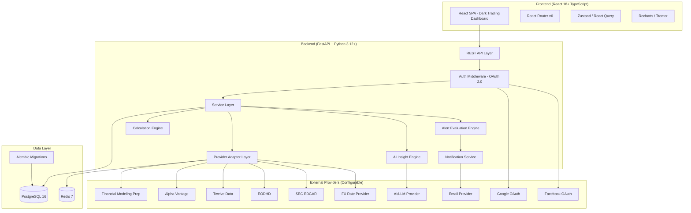
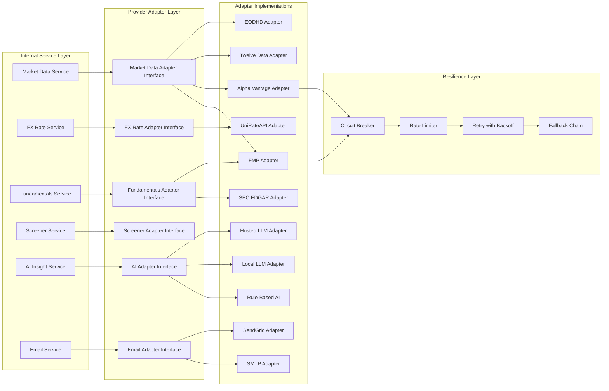
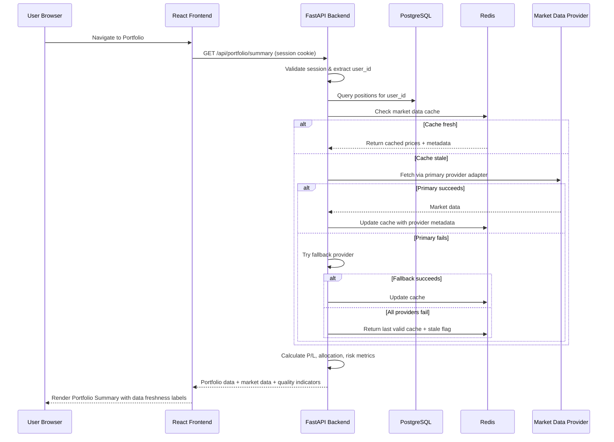
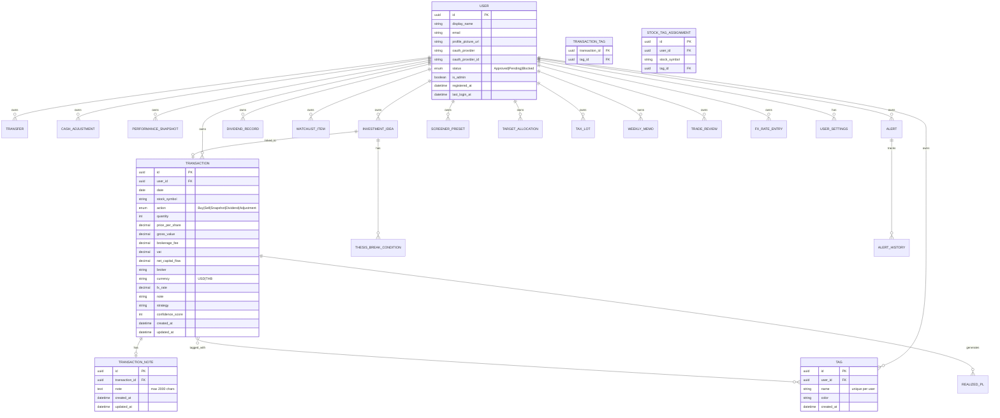

# Design Document: Investment History

## Overview

The Investment History system is a **Premium Personal Investment Cockpit** — a full-stack web application for serious stock investors to track trades, monitor portfolios, analyze performance, manage risk, and receive AI-powered insights. The system uses a **provider-agnostic market data architecture** that abstracts all external data sources behind adapter interfaces, enabling free-tier MVP operation while supporting upgrade to paid providers without architectural changes.

### Key Design Decisions

1. **Provider-Agnostic Market Data Layer**: All external data (prices, FX, fundamentals, screener, AI) accessed through adapter interfaces with fallback chains, circuit breakers, and Redis caching. No vendor lock-in to any single provider.

2. **FX-Aware Multi-Currency Accounting**: All monetary calculations support THB/USD with stored FX rates, enabling accurate cross-currency portfolio tracking with full audit trail.

3. **Tax Lot Accounting Engine**: Supports FIFO, LIFO, Average Cost, and Specific Lot methods for realized P/L calculation with proper lot tracking.

4. **Three-Phase Implementation**: MVP Core (internal accounting) → Market Data & Analytics → Premium Intelligence. Each phase is independently deployable.

5. **FastAPI + Python 3.12+ Backend**: Async-first with SQLAlchemy 2.0, Alembic migrations, Pydantic v2 validation, and structured service layer.

6. **React 18+ TypeScript Frontend**: Component-based with Tailwind CSS, Recharts/Tremor for charts, dark-first responsive design.

7. **PostgreSQL + Redis**: Transactional integrity for financial records, Redis for market data cache, rate limiting, and session management.

8. **Dark Trading Dashboard UI**: Professional Bloomberg-style dark theme as default, with light mode option.

## Architecture

### High-Level Architecture Diagram



### Provider Adapter Architecture



### Request Flow



### Layered Architecture

- **Presentation Layer**: React 18 SPA with React Router, Zustand state, Recharts/Tremor charts, Tailwind CSS dark theme
- **API Layer**: FastAPI routes organized by domain module with OpenAPI documentation
- **Service Layer**: Business logic, financial calculations, validation, orchestration
- **Calculation Engine**: Pure functions for Avg Cost, Tax Lots, P/L, Attribution, Risk, Position Sizing
- **Provider Layer**: Adapter interfaces with circuit breaker, rate limiter, fallback chain, cache
- **Data Access Layer**: SQLAlchemy 2.0 async ORM with repository pattern
- **Infrastructure Layer**: PostgreSQL, Redis, Alembic migrations, Docker Compose

## Components and Interfaces

### Backend API Modules

#### 1. Authentication Module (`/api/auth/`)

| Endpoint | Method | Description |
|----------|--------|-------------|
| `/api/auth/login/google` | GET | Initiate Google OAuth flow |
| `/api/auth/login/facebook` | GET | Initiate Facebook OAuth flow |
| `/api/auth/callback/google` | GET | Handle Google OAuth callback |
| `/api/auth/callback/facebook` | GET | Handle Facebook OAuth callback |
| `/api/auth/logout` | POST | Terminate session |
| `/api/auth/me` | GET | Get current user info + status |

#### 2. Trading Log Module (`/api/transactions/`)

| Endpoint | Method | Description |
|----------|--------|-------------|
| `/api/transactions` | GET | List transactions (filters: date_range, symbol, broker, action, tag, strategy, status) |
| `/api/transactions` | POST | Create buy/sell transaction |
| `/api/transactions/{id}` | GET | Get transaction detail |
| `/api/transactions/{id}` | PUT | Edit transaction |
| `/api/transactions/{id}` | DELETE | Delete transaction (with confirmation) |
| `/api/transactions/snapshot` | POST | Bulk import snapshot (atomic) |
| `/api/transactions/export` | GET | Export transactions as CSV |
| `/api/transactions/export-excel` | GET | Export transactions as Excel (.xlsx) with column headers |
| `/api/transactions/import-excel` | POST | Import transactions from Excel file (multipart/form-data) |
| `/api/transactions/import-excel/preview` | POST | Preview/validate Excel import without committing (returns row count, errors, duplicates) |
| `/api/transactions/{id}/notes` | PUT | Attach/update note (up to 2000 chars) |
| `/api/transactions/{id}/tags` | PUT | Assign tags to transaction |

**Excel Import/Export Design:**
- Export generates `.xlsx` with columns: Date, Symbol, Action, Qty, Price per Share, Fee, VAT, Broker, Note
- Import accepts `.xlsx` matching the same column format
- Duplicate detection: match on (date + stock_symbol + action + quantity + price_per_share) — exact match means duplicate
- Validation: all fields checked per row (required fields, types, date format, positive numbers, valid action values)
- Atomic import: if any row fails validation, no rows are committed
- Preview endpoint returns: `{ valid_rows: number, duplicate_rows: [{row, reason}], error_rows: [{row, field, error}], preview_data: [...] }`
- Import endpoint returns: `{ imported_count: number, message: string }`

#### 3. Money Transfer Module (`/api/transfers/`)

| Endpoint | Method | Description |
|----------|--------|-------------|
| `/api/transfers` | GET | List transfers (filters: date_range, broker, type, currency) |
| `/api/transfers` | POST | Create transfer with FX support |
| `/api/transfers/{id}` | PUT | Edit transfer (preserves audit history) |
| `/api/transfers/{id}` | DELETE | Delete transfer |
| `/api/transfers/export` | GET | Export transfers as CSV |

#### 4. Cash Ledger Module (`/api/cash-ledger/`)

| Endpoint | Method | Description |
|----------|--------|-------------|
| `/api/cash-ledger` | GET | Get cash ledger by broker |
| `/api/cash-ledger/summary` | GET | Total cash available across brokers |
| `/api/cash-ledger/adjustments` | POST | Manual cash adjustment entry |
| `/api/cash-ledger/export` | GET | Export cash ledger as CSV |

#### 5. Portfolio Module (`/api/portfolio/`)

| Endpoint | Method | Description |
|----------|--------|-------------|
| `/api/portfolio/summary` | GET | Aggregated portfolio with market data, P/L, allocation, risk |
| `/api/portfolio/closed` | GET | Closed positions (zero quantity) |
| `/api/portfolio/refresh` | POST | Force market data refresh (rate-limited) |
| `/api/portfolio/{symbol}/sentiment` | PUT | Set user sentiment (Bear/Bull/Neutral) |
| `/api/portfolio/attribution` | GET | Performance attribution by stock, sector, broker, tag, strategy |
| `/api/portfolio/health-score` | GET | Portfolio Health Score (0-100) with breakdown |
| `/api/portfolio/sector-heatmap` | GET | Sector allocation and performance heatmap data |

#### 6. Performance Module (`/api/performance/`)

| Endpoint | Method | Description |
|----------|--------|-------------|
| `/api/performance/snapshots` | GET | List snapshots (filters: date_range, period) |
| `/api/performance/snapshots` | POST | Record portfolio snapshot |
| `/api/performance/snapshots/{id}` | PUT | Edit snapshot |
| `/api/performance/snapshots/{id}` | DELETE | Delete snapshot |
| `/api/performance/returns` | GET | Period/Cumulative/Monthly/Yearly returns |
| `/api/performance/drawdown` | GET | Maximum drawdown calculation |
| `/api/performance/benchmark` | GET | Benchmark comparison data |
| `/api/performance/benchmark/config` | PUT | Configure benchmark selections |

#### 7. Dashboard Module (`/api/dashboard/`)

| Endpoint | Method | Description |
|----------|--------|-------------|
| `/api/dashboard` | GET | Full dashboard data (metrics, what_changed, action_needed, top/bottom, alerts) |
| `/api/dashboard/review` | POST | Trigger one-click portfolio review |
| `/api/dashboard/review/export` | GET | Export review as PDF/Markdown |

#### 8. Alerts Module (`/api/alerts/`)

| Endpoint | Method | Description |
|----------|--------|-------------|
| `/api/alerts` | GET | List alerts (filters: status, type, urgency) |
| `/api/alerts` | POST | Create alert (price, smart, thesis) |
| `/api/alerts/{id}` | PUT | Update alert |
| `/api/alerts/{id}` | DELETE | Delete alert |
| `/api/alerts/{id}/snooze` | POST | Snooze alert for duration |
| `/api/alerts/{id}/resolve` | POST | Mark alert resolved |
| `/api/alerts/evaluate` | POST | Trigger alert evaluation (internal/scheduled) |
| `/api/alerts/preferences` | GET | Get email notification preferences |
| `/api/alerts/preferences` | PUT | Update email notification preferences |

#### 9. Dividend Tracker Module (`/api/dividends/`)

| Endpoint | Method | Description |
|----------|--------|-------------|
| `/api/dividends` | GET | List dividend records (filters: symbol, broker, date_range) |
| `/api/dividends` | POST | Record manual dividend payment |
| `/api/dividends/{id}` | PUT | Edit dividend record |
| `/api/dividends/{id}` | DELETE | Delete dividend record |
| `/api/dividends/summary` | GET | Summary by stock, broker, month, year |
| `/api/dividends/projection` | GET | Projected annual dividend income |
| `/api/dividends/export` | GET | Export dividend records |

#### 10. Realized P/L & Tax Lots Module (`/api/realized-pl/`)

| Endpoint | Method | Description |
|----------|--------|-------------|
| `/api/realized-pl` | GET | List realized P/L records (filters: symbol, date_range, method, term) |
| `/api/realized-pl/summary` | GET | Cumulative totals (monthly/yearly/all-time) |
| `/api/realized-pl/tax-lots` | GET | View tax lot details by symbol |
| `/api/realized-pl/settings` | GET | Get cost basis method setting |
| `/api/realized-pl/settings` | PUT | Set default cost basis method |
| `/api/realized-pl/export` | GET | Export realized P/L report |

#### 11. Watchlist Module (`/api/watchlist/`)

| Endpoint | Method | Description |
|----------|--------|-------------|
| `/api/watchlist` | GET | List watchlist with market data |
| `/api/watchlist` | POST | Add stock to watchlist |
| `/api/watchlist/{id}` | PUT | Update target prices, notes, tags |
| `/api/watchlist/{id}` | DELETE | Remove from watchlist |
| `/api/watchlist/near-target` | GET | Stocks at or near target entry price |

#### 12. Investment Ideas / Thesis Board Module (`/api/ideas/`)

| Endpoint | Method | Description |
|----------|--------|-------------|
| `/api/ideas` | GET | List ideas (filters: status, symbol, risk_level, tag) |
| `/api/ideas` | POST | Create idea with thesis details |
| `/api/ideas/{id}` | PUT | Update idea (status, thesis, targets) |
| `/api/ideas/{id}` | DELETE | Delete idea |
| `/api/ideas/{id}/link-transaction` | POST | Link idea to executed transaction |
| `/api/ideas/{id}/break-conditions` | GET | Get thesis break conditions |
| `/api/ideas/{id}/break-conditions` | POST | Add thesis break condition |
| `/api/ideas/{id}/break-conditions/{cid}` | DELETE | Remove break condition |
| `/api/ideas/board` | GET | Board view (Kanban by status) |
| `/api/ideas/calendar` | GET | Calendar view (by review/catalyst dates) |

#### 13. Stock Screener Module (`/api/screener/`)

| Endpoint | Method | Description |
|----------|--------|-------------|
| `/api/screener/search` | POST | Execute screener query with filters |
| `/api/screener/presets` | GET | List saved presets |
| `/api/screener/presets` | POST | Save screener preset |
| `/api/screener/presets/{id}` | PUT | Edit preset |
| `/api/screener/presets/{id}` | DELETE | Delete preset |
| `/api/screener/strategies` | GET | Get quick strategy chips |

**Tradeable Stocks Filter:** The screener query always includes an exchange filter to restrict results to major US exchanges only (NMS/NYQ/NGM/NCM/ASE/PCX). Additionally, results are post-filtered to exclude:
- Non-EQUITY quote types (warrants, preferred shares, units)
- OTC/pink sheet symbols
- Preferred shares identified by symbol patterns (e.g., `-P`, `.P` suffixes)

This ensures only tradeable common stocks appear in results.

#### 14. Scenario Simulator Module (`/api/simulator/`)

| Endpoint | Method | Description |
|----------|--------|-------------|
| `/api/simulator/run` | POST | Run simulation (price change, buy/sell, cash, FX, rebalance) |
| `/api/simulator/compare` | GET | Current vs simulated portfolio comparison |

#### 15. Rebalancing & Position Sizing Module (`/api/rebalancing/`)

| Endpoint | Method | Description |
|----------|--------|-------------|
| `/api/rebalancing/insights` | GET | Current vs target allocation with recommendations |
| `/api/rebalancing/targets` | GET | Get target allocations |
| `/api/rebalancing/targets` | PUT | Set target allocations (by symbol, sector, tag, asset class) |
| `/api/rebalancing/position-size` | POST | Calculate recommended position size |

#### 16. Risk Metrics Module (`/api/risk/`)

| Endpoint | Method | Description |
|----------|--------|-------------|
| `/api/risk/metrics` | GET | Portfolio beta, concentration, volatility, drawdown, cash ratio |
| `/api/risk/warnings` | GET | Active risk warnings |

#### 17. Behavioral Analytics Module (`/api/behavioral/`)

| Endpoint | Method | Description |
|----------|--------|-------------|
| `/api/behavioral/stats` | GET | Win rate, avg winner/loser, payoff ratio, holding periods |
| `/api/behavioral/patterns` | GET | Identified behavior patterns |
| `/api/behavioral/by-tag` | GET | Performance breakdown by tag |
| `/api/behavioral/by-sector` | GET | Performance breakdown by sector |
| `/api/behavioral/by-strategy` | GET | Performance breakdown by strategy |

#### 18. AI Insights Module (`/api/ai/`)

| Endpoint | Method | Description |
|----------|--------|-------------|
| `/api/ai/weekly-memo` | GET | Get current/latest weekly memo |
| `/api/ai/weekly-memo/history` | GET | List historical memos |
| `/api/ai/weekly-memo/generate` | POST | Generate new weekly memo |
| `/api/ai/trade-review/{transaction_id}` | GET | Get AI trade review for a sold position |
| `/api/ai/trade-review/generate` | POST | Generate trade review |
| `/api/ai/settings` | GET | AI provider settings |
| `/api/ai/settings` | PUT | Update AI settings (mode, provider) |

#### 19. Tags Module (`/api/tags/`)

| Endpoint | Method | Description |
|----------|--------|-------------|
| `/api/tags` | GET | List all user tags |
| `/api/tags` | POST | Create tag |
| `/api/tags/{id}` | PUT | Rename tag |
| `/api/tags/{id}` | DELETE | Delete tag (with reassignment option) |
| `/api/tags/performance` | GET | Performance metrics aggregated per tag |
| `/api/tags/{id}/assignments` | GET | Items assigned to this tag |

#### 20. Trending Stocks Module (`/api/trending/`)

| Endpoint | Method | Description |
|----------|--------|-------------|
| `/api/trending` | GET | Top 50 gainers, top 50 losers, top 50 most active (cached 15 min) |

#### 21. Reports Module (`/api/reports/`)

| Endpoint | Method | Description |
|----------|--------|-------------|
| `/api/reports/portfolio-summary` | GET | Portfolio summary report |
| `/api/reports/performance` | GET | Performance report with date range |
| `/api/reports/realized-pl` | GET | Realized P/L report |
| `/api/reports/dividends` | GET | Dividend income report |
| `/api/reports/cash-ledger` | GET | Cash ledger report |
| `/api/reports/tax-lots` | GET | Tax lot report |
| `/api/reports/benchmark` | GET | Benchmark comparison report |
| `/api/reports/export/{type}` | GET | Export report as PDF/CSV/Markdown |

#### 22. Import/Export Module (`/api/import-export/`)

| Endpoint | Method | Description |
|----------|--------|-------------|
| `/api/import-export/import` | POST | Import CSV (transactions, transfers, dividends, watchlist, ideas, snapshots) |
| `/api/import-export/import/preview` | POST | Preview import with validation |
| `/api/import-export/export/backup` | GET | Full account JSON backup |
| `/api/import-export/import/restore` | POST | Restore from JSON backup |

#### 23. Admin Module (`/api/admin/`)

| Endpoint | Method | Description |
|----------|--------|-------------|
| `/api/admin/users` | GET | List all users with status |
| `/api/admin/users/{id}/approve` | POST | Approve user |
| `/api/admin/users/{id}/block` | POST | Block user |
| `/api/admin/users/{id}/revert` | POST | Revert to pending |

#### 24. Provider Management Module (`/api/providers/`)

| Endpoint | Method | Description |
|----------|--------|-------------|
| `/api/providers/status` | GET | Provider health status, usage, circuit breaker state |
| `/api/providers/compatibility` | GET | Provider compatibility matrix |

#### 25. User Settings Module (`/api/settings/`)

| Endpoint | Method | Description |
|----------|--------|-------------|
| `/api/settings` | GET | Get user settings (theme, cost basis method, AI, alerts) |
| `/api/settings` | PUT | Update user settings |
| `/api/settings/fx-rates` | GET | Get cached/manual FX rates |
| `/api/settings/fx-rates` | POST | Add manual FX rate entry |

### Frontend Pages and Routes

| Page | Route | Phase | Description |
|------|-------|-------|-------------|
| Login | `/login` | 1 | OAuth login (Google, Facebook) |
| Dashboard | `/` | 1 | Premium overview with What Changed, Action Needed, AI Insight |
| Portfolio Summary | `/portfolio` | 2 | Positions + market data + P/L + allocation + badges |
| Trading Log | `/trading` | 1 | Transaction CRUD + journal + tags + export |
| Money Transfers | `/transfers` | 1 | Transfer CRUD with FX support |
| Performance History | `/performance` | 2 | Snapshots + charts + benchmark + returns |
| Trade Journal | `/journal` | 3 | Notes/tags/strategy view + behavioral link |
| Watchlist | `/watchlist` | 2 | Monitored stocks with target tracking |
| Investment Ideas | `/ideas` | 3 | Thesis board (Board/List/Calendar views) |
| Stock Screener | `/screener` | 3 | Premium screener with strategy chips |
| Alerts | `/alerts` | 2 | Alert center (active, triggered, snoozed, resolved) |
| Dividend Tracker | `/dividends` | 2 | Dividend records + yield + projection |
| Realized P/L | `/realized-pl` | 2 | Tax lot accounting + realized gains/losses |
| Risk & Rebalancing | `/risk` | 3 | Risk metrics + rebalancing + position sizing |
| Reports | `/reports` | 2 | Report generation + export |
| Admin | `/admin` | 1 | User management (admin only) |
| Settings | `/settings` | 1 | User preferences, FX rates, AI config |

### Shared Frontend Components

- `AppShell`: Dark sidebar + content layout with responsive collapse
- `NavigationMenu`: Collapsible sidebar with Lucide icons, grouped sections, theme toggle
- `DataTable`: Sortable headers, sticky headers, pagination, column visibility, density toggle, row actions, export
- `Pagination`: Reusable pagination control with Previous/Next buttons, page numbers with ellipsis, "Showing X to Y of Z entries" info, configurable items-per-page selector (10/20/50/100). Used by Trading Log and other large tables.
- `DarkCard`: Elevated card with dark theme tokens
- `MetricCard`: Dashboard metric display (value, label, change indicator)
- `ConfirmModal`: Destructive action confirmation
- `Toast`: Success/error notifications (3s+ display)
- `FilterPanel`: Reusable filter controls (date range, multi-select, search)
- `SectorHeatmap`: Treemap sized by allocation, colored by performance
- `PerformanceChart`: Line chart with selectable ranges, benchmark overlay
- `Badge`: Status/category badges (Winner, Loser, High Beta, Data Warning, etc.)
- `DataQualityIndicator`: Shows data freshness, stale warning, provider source
- `LoadingSkeleton`: Content loading placeholders
- `EmptyState`: Empty data states with action guidance
- `ErrorState`: Error states with retry/fallback guidance

#### Table Layout Strategy

All data tables use `table-layout: fixed` with explicit `<colgroup>` column width definitions to guarantee header/body alignment. Column width conventions:
- Numeric columns (Qty, Price, Values, Fees): right-aligned (`text-align: right`) in both `<th>` and `<td>`, using `font-variant-numeric: tabular-nums` for consistent digit widths.
- Text columns (Date, Symbol, Action, Broker): left-aligned.
- Action columns: right-aligned, `white-space: nowrap`.
- Overflow is handled with `overflow: hidden; text-overflow: ellipsis` per cell.

### Service Layer Interfaces

```python
# === Core Service Interfaces ===

class TradingService:
    async def create_transaction(self, user_id: UUID, data: TransactionCreate) -> Transaction
    async def edit_transaction(self, user_id: UUID, tx_id: UUID, data: TransactionUpdate) -> Transaction
    async def delete_transaction(self, user_id: UUID, tx_id: UUID) -> None
    async def list_transactions(self, user_id: UUID, filters: TransactionFilters) -> PaginatedResult[Transaction]
    async def import_snapshot(self, user_id: UUID, entries: list[SnapshotEntry]) -> list[Transaction]
    async def get_holdings(self, user_id: UUID, symbol: str) -> HoldingsDetail
    async def export_csv(self, user_id: UUID, filters: TransactionFilters) -> bytes

class TransferService:
    async def create_transfer(self, user_id: UUID, data: TransferCreate) -> Transfer
    async def edit_transfer(self, user_id: UUID, transfer_id: UUID, data: TransferUpdate) -> Transfer
    async def delete_transfer(self, user_id: UUID, transfer_id: UUID) -> None
    async def list_transfers(self, user_id: UUID, filters: TransferFilters) -> PaginatedResult[Transfer]

class CashLedgerService:
    async def get_ledger_by_broker(self, user_id: UUID) -> list[BrokerCashLedger]
    async def get_total_cash(self, user_id: UUID) -> Decimal
    async def add_adjustment(self, user_id: UUID, data: CashAdjustment) -> CashAdjustmentRecord
    async def recalculate(self, user_id: UUID, broker: str) -> BrokerCashLedger

class PortfolioService:
    async def get_summary(self, user_id: UUID) -> PortfolioSummary
    async def get_closed_positions(self, user_id: UUID) -> list[ClosedPosition]
    async def get_attribution(self, user_id: UUID, period: str) -> AttributionResult
    async def get_health_score(self, user_id: UUID) -> HealthScoreResult
    async def get_sector_heatmap(self, user_id: UUID) -> list[SectorHeatmapItem]
    async def set_sentiment(self, user_id: UUID, symbol: str, sentiment: str) -> None

class TaxLotService:
    async def calculate_realized_pl(self, user_id: UUID, sell_tx: Transaction) -> RealizedPLResult
    async def get_tax_lots(self, user_id: UUID, symbol: str) -> list[TaxLot]
    async def get_cost_basis(self, user_id: UUID, symbol: str, method: CostBasisMethod) -> Decimal
    async def set_default_method(self, user_id: UUID, method: CostBasisMethod) -> None
```

```python
# === Provider & Market Data Interfaces ===

class MarketDataAdapter(Protocol):
    """Provider-agnostic interface for market data"""
    async def get_quote(self, symbol: str) -> QuoteData | None
    async def get_historical(self, symbol: str, start: date, end: date) -> list[PriceBar]
    async def get_company_profile(self, symbol: str) -> CompanyProfile | None
    async def get_batch_quotes(self, symbols: list[str]) -> dict[str, QuoteData]
    def provider_name(self) -> str

class FXRateAdapter(Protocol):
    """Provider-agnostic interface for FX rates"""
    async def get_rate(self, base: str, quote: str, date: date) -> FXRateResult | None
    async def get_latest_rate(self, base: str, quote: str) -> FXRateResult | None
    def provider_name(self) -> str

class FundamentalsAdapter(Protocol):
    """Provider-agnostic interface for company fundamentals"""
    async def get_financials(self, symbol: str) -> FinancialStatements | None
    async def get_dividend_history(self, symbol: str) -> list[DividendRecord] | None
    async def get_earnings_calendar(self, symbol: str) -> list[EarningsDate] | None
    def provider_name(self) -> str

class EmailAdapter(Protocol):
    """Pluggable email notification adapter"""
    async def send(self, to: str, subject: str, html_body: str) -> bool
    def provider_name(self) -> str

class AIInsightAdapter(Protocol):
    """Pluggable AI insight adapter"""
    async def generate_weekly_memo(self, context: MemoContext) -> str
    async def generate_trade_review(self, context: TradeReviewContext) -> str
    def provider_name(self) -> str  # "disabled", "rule-based", "local-llm", "hosted-llm"

class MarketDataService:
    """Orchestrates provider adapters with caching, fallback, and circuit breaking"""
    async def get_ticker_info(self, symbol: str) -> TickerInfo
    async def refresh_batch(self, symbols: list[str]) -> dict[str, TickerInfo]
    async def get_trending(self) -> TrendingData  # Returns 50 items per category (gainers, losers, most_active)
    async def get_fx_rate(self, base: str, quote: str, date: date) -> FXRateResult
    async def get_data_quality_score(self, user_id: UUID) -> DataQualityScore
    async def get_provider_status(self) -> list[ProviderStatus]

class PerformanceService:
    async def record_snapshot(self, user_id: UUID, data: SnapshotCreate) -> PerformanceSnapshot
    async def list_snapshots(self, user_id: UUID, filters: SnapshotFilters) -> list[PerformanceSnapshot]
    async def get_returns(self, user_id: UUID, period: str) -> ReturnMetrics
    async def get_benchmark_comparison(self, user_id: UUID) -> BenchmarkComparison
    async def get_max_drawdown(self, user_id: UUID) -> DrawdownResult

class AlertService:
    async def create_alert(self, user_id: UUID, data: AlertCreate) -> Alert
    async def evaluate_alerts(self, user_id: UUID) -> list[TriggeredAlert]
    async def snooze_alert(self, user_id: UUID, alert_id: UUID, duration: timedelta) -> None
    async def get_preferences(self, user_id: UUID) -> AlertPreferences
    async def update_preferences(self, user_id: UUID, prefs: AlertPreferences) -> None

class AIInsightService:
    async def generate_weekly_memo(self, user_id: UUID) -> WeeklyMemo
    async def generate_trade_review(self, user_id: UUID, tx_id: UUID) -> TradeReview
    async def get_memo_history(self, user_id: UUID) -> list[WeeklyMemo]

class BehavioralAnalyticsService:
    async def get_stats(self, user_id: UUID) -> BehavioralStats
    async def get_patterns(self, user_id: UUID) -> list[BehaviorPattern]

class ScenarioSimulatorService:
    async def run_simulation(self, user_id: UUID, scenario: ScenarioInput) -> SimulationResult
    async def compare(self, user_id: UUID, scenario_id: UUID) -> ComparisonResult

class PositionSizingService:
    async def calculate(self, user_id: UUID, params: PositionSizeInput) -> PositionSizeResult
```

## Data Models

### Entity Relationship Diagram

```mermaid
erDiagram
    TRANSFER {
        uuid id PK
        uuid user_id FK
        date date
        string broker
        enum transfer_type "In|Out"
        string original_currency "THB|USD"
        decimal original_amount
        decimal fx_rate
        decimal converted_usd_amount
        decimal fx_fee
        string fx_provider
        datetime fx_source_timestamp
        datetime fx_fetch_timestamp
        string note
        datetime created_at
        datetime updated_at
    }

    CASH_ADJUSTMENT {
        uuid id PK
        uuid user_id FK
        date date
        string broker
        decimal amount
        string reason
        string note
        datetime created_at
    }

    TAX_LOT {
        uuid id PK
        uuid user_id FK
        string stock_symbol
        uuid buy_transaction_id FK
        date acquisition_date
        int original_quantity
        int remaining_quantity
        decimal cost_per_share
        string broker
        string currency
        decimal fx_rate_at_purchase
        enum status "Open|Closed|Partial"
        datetime created_at
        datetime updated_at
    }

    REALIZED_PL {
        uuid id PK
        uuid user_id FK
        date sell_date
        string stock_symbol
        uuid sell_transaction_id FK
        uuid tax_lot_id FK
        int quantity_sold
        decimal sell_price
        decimal cost_basis_per_share
        decimal realized_pl
        int holding_duration_days
        enum term_type "Short-term|Long-term"
        enum cost_basis_method "FIFO|LIFO|AvgCost|SpecificLot"
        string broker
        datetime created_at
    }

    FX_RATE_ENTRY {
        uuid id PK
        uuid user_id FK
        string base_currency
        string quote_currency
        date rate_date
        decimal rate
        string provider_name
        datetime source_timestamp
        datetime fetch_timestamp
        boolean is_manual
        enum staleness "Fresh|Stale|Manual"
        datetime created_at
    }

    PERFORMANCE_SNAPSHOT {
        uuid id PK
        uuid user_id FK
        date date
        decimal total_market_value
        decimal total_cost
        decimal cash_balance
        decimal net_invested
        decimal fx_rate_snapshot
        string notes
        datetime created_at
        datetime updated_at
    }

    DIVIDEND_RECORD {
        uuid id PK
        uuid user_id FK
        date date
        string stock_symbol
        decimal amount_per_share
        int shares_held
        decimal total_amount
        string currency
        decimal tax_withheld
        string broker
        enum source "Manual|API_Prefill"
        string source_label
        datetime created_at
        datetime updated_at
    }
```

```mermaid
erDiagram
    ALERT {
        uuid id PK
        uuid user_id FK
        string stock_symbol
        enum alert_category "Price|Smart|Thesis"
        enum alert_type "Above|Below|Concentration|Drawdown|Overweight|Underweight|HighBeta|StaleData|ThesisReview|Earnings|DividendChange|52WeekHighLow|WatchlistTarget"
        decimal target_value
        string condition_description
        enum status "Active|Triggered|Snoozed|Resolved|Disabled"
        enum urgency "Low|Medium|High|Critical"
        boolean email_enabled
        datetime snoozed_until
        datetime triggered_at
        string note
        decimal data_confidence
        datetime created_at
        datetime updated_at
    }

    ALERT_HISTORY {
        uuid id PK
        uuid alert_id FK
        enum event "Created|Triggered|Snoozed|Resolved|EmailSent|EmailFailed"
        string details
        datetime occurred_at
    }

    WATCHLIST_ITEM {
        uuid id PK
        uuid user_id FK
        string stock_symbol
        decimal target_entry_price
        decimal target_exit_price
        enum risk_level "Low|Medium|High"
        text notes
        uuid thesis_link_id FK
        datetime created_at
        datetime updated_at
    }

    INVESTMENT_IDEA {
        uuid id PK
        uuid user_id FK
        string stock_symbol
        string title
        text thesis
        text bull_case
        text bear_case
        decimal target_entry_price
        decimal target_exit_price
        enum risk_level "Low|Medium|High"
        string source_link
        enum status "Researching|Watching|NearEntry|Bought|Passed|Closed"
        int confidence_score "1-10"
        date expected_timeline
        date catalyst_date
        date review_date
        uuid linked_transaction_id FK
        datetime created_at
        datetime updated_at
    }

    THESIS_BREAK_CONDITION {
        uuid id PK
        uuid idea_id FK
        string condition_type "price_below|drawdown_pct|time_elapsed|custom"
        decimal threshold_value
        string description
        boolean is_triggered
        datetime triggered_at
        datetime created_at
    }

    TARGET_ALLOCATION {
        uuid id PK
        uuid user_id FK
        string target_key
        enum target_type "Symbol|Sector|Tag|AssetClass"
        decimal target_percentage
        decimal threshold_deviation
        datetime updated_at
    }

    SCREENER_PRESET {
        uuid id PK
        uuid user_id FK
        string name
        json filter_criteria
        boolean is_shared
        datetime created_at
        datetime updated_at
    }

    WEEKLY_MEMO {
        uuid id PK
        uuid user_id FK
        date memo_date
        text content
        enum generation_mode "RuleBased|LocalLLM|HostedLLM"
        boolean email_sent
        json data_sources_used
        json stale_data_warnings
        datetime generated_at
    }

    TRADE_REVIEW {
        uuid id PK
        uuid user_id FK
        uuid sell_transaction_id FK
        string stock_symbol
        text review_content
        enum generation_mode "RuleBased|LocalLLM|HostedLLM"
        decimal realized_pl
        int holding_days
        datetime generated_at
    }

    USER_SETTINGS {
        uuid id PK
        uuid user_id FK
        enum theme "Dark|Light"
        enum default_cost_basis_method "FIFO|LIFO|AvgCost|SpecificLot"
        enum ai_mode "Disabled|RuleBased|LocalLLM|HostedLLM"
        boolean email_weekly_memo
        boolean email_alerts_enabled
        json email_alert_categories
        string default_broker
        string default_currency
        json benchmark_selections
        datetime updated_at
    }

    SESSION {
        uuid id PK
        uuid user_id FK
        string token_hash
        string ip_address
        string user_agent
        datetime expires_at
        datetime created_at
    }

    MARKET_DATA_CACHE {
        string symbol PK
        json quote_data
        string provider_name
        datetime source_timestamp
        datetime last_fetched
        enum staleness "Fresh|Stale|Unavailable"
        decimal confidence_score
        int ttl_seconds
    }

    PROVIDER_STATUS {
        string provider_name PK
        enum circuit_state "Closed|Open|HalfOpen"
        int success_count
        int failure_count
        int cache_hit_count
        decimal success_rate
        string last_error
        datetime last_success_at
        datetime last_failure_at
        datetime updated_at
    }
```







### Calculation Logic

#### Gross Value
```
gross_value = quantity × price_per_share
```

#### Net Capital Flow
```
If action == "Buy":
    net_capital_flow = gross_value + brokerage_fee + vat
If action == "Sell":
    net_capital_flow = gross_value - brokerage_fee - vat
```

#### FX Conversion (THB → USD)
```
converted_usd_amount = original_amount / fx_rate
    where fx_rate = THB per 1 USD (e.g., 35.5 THB/USD)
```

#### Average Cost (Weighted, FX-aware)
```
avg_cost = Σ(quantity_i × cost_per_share_i_in_usd) / Σ(quantity_i)
    where cost_per_share_i_in_usd = price_per_share_i / fx_rate_i (if non-USD)
    includes all Buy + Snapshot entries for that symbol
```

#### Tax Lot Cost Basis Methods
```
FIFO: Sell depletes oldest lots first
LIFO: Sell depletes newest lots first  
Average Cost: avg_cost across all open lots
Specific Lot: User selects which lot(s) to sell from
```

#### Realized P/L (per tax lot match)
```
realized_pl = (sell_price - cost_basis_per_share) × quantity_sold
term_type = "Long-term" if holding_duration_days >= 365 else "Short-term"
holding_duration_days = sell_date - acquisition_date
```

#### Cash Ledger (per broker)
```
ending_cash = starting_cash
    + Σ(deposits)
    - Σ(withdrawals) 
    - Σ(buy_net_capital_flow)
    + Σ(sell_net_capital_flow)
    - Σ(additional_fees)
    + Σ(dividends)
    ± Σ(fx_adjustments)
    ± Σ(manual_adjustments)
```

#### Unrealized P/L
```
unrealized_pl = (current_price × quantity) - (avg_cost × quantity)
```

#### ROI Percent
```
roi_percent = (unrealized_pl / total_cost) × 100
```

#### Allocation (by market value)
```
allocation_pct = (position_market_value / total_portfolio_market_value) × 100
```

#### Period Return
```
period_return = ((end_value - start_value) / start_value) × 100
```

#### Cumulative Return
```
cumulative_return = ((latest_value - earliest_value) / earliest_value) × 100
```

#### Maximum Drawdown
```
max_drawdown = max((peak_i - trough_j) / peak_i × 100)
    for all peaks i and subsequent troughs j in the value series
```

#### Portfolio Beta (weighted)
```
portfolio_beta = Σ(allocation_weight_i × beta_i) for all positions with known beta
```

#### Dividend Yield on Cost
```
yield_on_cost = (annual_dividends_for_stock / total_cost_of_stock) × 100
```

#### Portfolio Health Score (0-100)
```
health_score = weighted_sum(
    diversification_score × 0.15,
    concentration_score × 0.15,
    drawdown_score × 0.10,
    benchmark_relative_score × 0.15,
    cash_drag_score × 0.05,
    data_quality_score × 0.10,
    thesis_completeness × 0.10,
    journal_discipline × 0.05,
    risk_adjusted_return × 0.15
)
```

#### Position Sizing
```
max_position_value = portfolio_value × max_risk_per_trade
risk_per_share = entry_price - stop_loss_price
suggested_shares = max_position_value / risk_per_share
capital_required = suggested_shares × entry_price
portfolio_allocation = capital_required / portfolio_value × 100
expected_downside = suggested_shares × risk_per_share
```

#### Behavioral Analytics
```
win_rate = winning_trades / total_closed_trades × 100
avg_winner = Σ(positive_realized_pl) / count(positive_realized_pl)
avg_loser = Σ(negative_realized_pl) / count(negative_realized_pl)
payoff_ratio = avg_winner / |avg_loser|
avg_holding_period = Σ(holding_days) / total_closed_trades
```

#### Benchmark Comparison
```
alpha = portfolio_return - benchmark_return (over same period)
relative_performance = portfolio_return - benchmark_return
tracking_difference = Σ|monthly_portfolio_return - monthly_benchmark_return| / months
win_months = count(months where portfolio_return > benchmark_return)
```

#### Portfolio Attribution (by category)
```
contribution_i = (position_return_i × position_weight_i) / total_portfolio_return × 100
    grouped by: stock, sector, broker, tag, strategy, currency/FX, dividend, realized, unrealized
```

## Correctness Properties

*A property is a characteristic or behavior that should hold true across all valid executions of a system—essentially, a formal statement about what the system should do. Properties serve as the bridge between human-readable specifications and machine-verifiable correctness guarantees.*

### Property 1: Transaction Calculation Correctness

*For any* valid transaction with quantity Q, price_per_share P, brokerage_fee F, and VAT V, the stored gross_value SHALL equal Q × P, and the net_capital_flow SHALL equal (Q × P) + F + V for Buy actions or (Q × P) - F - V for Sell actions.

**Validates: Requirements 1.1, 1.3, 1.4**

### Property 2: Invalid Transaction Rejection

*For any* transaction submission where at least one of the following holds: a required field is missing, quantity ≤ 0, price_per_share ≤ 0, brokerage_fee < 0, VAT < 0, date is in the future, date format is invalid, or stock_symbol is empty — the system SHALL reject the transaction and return field-level validation errors without persisting any data.

**Validates: Requirements 1.2, 1.6**

### Property 3: Holdings Non-Negativity Invariant

*For any* stock symbol and user, the total held quantity SHALL equal the sum of all Buy quantities plus all Snapshot quantities minus all Sell quantities. No operation (sell, delete, edit) SHALL be permitted that would cause any symbol's held quantity to become negative.

**Validates: Requirements 1.5, 6.2**

### Property 4: Snapshot Import Atomicity

*For any* batch of snapshot entries where at least one entry fails validation (missing field, quantity ≤ 0, price ≤ 0, or invalid symbol), the system SHALL reject the entire batch, persist none of the entries, and return all row-level validation errors.

**Validates: Requirements 2.4, 2.5**

### Property 5: FX Conversion Correctness

*For any* money transfer with original_currency ≠ USD, original_amount A, and fx_rate R (where R > 0), the stored converted_usd_amount SHALL equal A / R. Both original_amount and converted_usd_amount SHALL be preserved and retrievable after storage.

**Validates: Requirements 3.1, 3.4, 3.5**

### Property 6: FX-Aware Dashboard Aggregation

*For any* set of money transfers with mixed currencies, the Dashboard Total Invested SHALL equal the sum of all "In" transfers' converted_usd_amount values, Total Withdrawn SHALL equal the sum of all "Out" transfers' converted_usd_amount values, and Net Invested SHALL equal Total Invested minus Total Withdrawn.

**Validates: Requirements 3.6, 9.1**

### Property 7: Cash Ledger Accounting Invariant

*For any* broker and user, the ending cash balance SHALL equal: starting_cash + deposits - withdrawals - buy_outflows + sell_inflows - fees + dividends ± fx_adjustments ± manual_adjustments. The total cash available SHALL equal the sum of all brokers' ending cash balances.

**Validates: Requirements 4.1, 4.3**

### Property 8: Negative Cash Warning

*For any* broker cash ledger calculation that results in a negative ending balance, the system SHALL generate a warning indicator.

**Validates: Requirements 4.4**

### Property 9: Query Sort Order

*For any* trading log query, the returned transactions SHALL be sorted by date descending. *For any* performance snapshot query, results SHALL be sorted by date ascending. The sort invariant SHALL hold regardless of the number of records or filter criteria applied.

**Validates: Requirements 5.1, 10.1**

### Property 10: Filter AND Logic Correctness

*For any* set of filter criteria (date_range, symbol, broker, action, tag, strategy) applied to a query, every item in the result set SHALL satisfy ALL active filter conditions simultaneously. No item satisfying all conditions SHALL be excluded. Symbol and broker matching SHALL be case-insensitive.

**Validates: Requirements 5.2**

### Property 11: Edit Recalculation Consistency

*For any* successfully edited transaction, the transaction ID SHALL remain unchanged, the stored gross_value and net_capital_flow SHALL reflect the new field values, and all derived values (holdings quantity, avg_cost, tax lots, realized P/L, unrealized P/L, allocation, cash_ledger) SHALL be consistent with a full recalculation from the complete transaction history.

**Validates: Requirements 6.1, 6.3**

### Property 12: Zero-Quantity Position Exclusion

*For any* portfolio summary query, no position in the active result set SHALL have a held quantity of zero. Zero-quantity (closed) positions SHALL only appear through the explicit closed positions endpoint.

**Validates: Requirements 7.5**

### Property 13: Period Return Calculation

*For any* two performance snapshots where the earlier value is greater than zero, the period return SHALL equal ((later_value - earlier_value) / earlier_value) × 100. The cumulative return over a sequence SHALL equal ((latest_value - earliest_value) / earliest_value) × 100.

**Validates: Requirements 10.2**

### Property 14: Maximum Drawdown Calculation

*For any* sequence of portfolio value snapshots with at least two entries, the maximum drawdown SHALL equal the largest percentage decline from any peak to any subsequent trough, calculated as (peak - trough) / peak × 100. The result SHALL be non-negative and bounded by [0, 100].

**Validates: Requirements 10.2, 21.1**

### Property 15: Benchmark Comparison Correctness

*For any* portfolio return series and benchmark return series over the same time period, alpha SHALL equal portfolio_return minus benchmark_return. Win months SHALL equal the count of months where portfolio monthly return exceeds benchmark monthly return.

**Validates: Requirements 11.2, 11.4**

### Property 16: Attribution Sum Invariant

*For any* portfolio attribution calculation, the sum of all individual position contributions SHALL equal the total portfolio return (within floating-point tolerance). This invariant SHALL hold regardless of grouping dimension (stock, sector, broker, tag, strategy).

**Validates: Requirements 12.1, 12.2**

### Property 17: Tax Lot FIFO/LIFO Ordering

*For any* sell transaction under FIFO method, the system SHALL deplete tax lots starting from the oldest acquisition date. Under LIFO, the system SHALL deplete lots starting from the newest acquisition date. Under Average Cost, the cost_basis_per_share SHALL equal the weighted average across all open lots. After any sell, the sum of all remaining lot quantities plus total sold quantities SHALL equal total purchased quantities.

**Validates: Requirements 18.1, 18.2, 18.3**

### Property 18: Realized P/L Calculation

*For any* sell matched against a tax lot with cost_basis_per_share C, sell_price S, and quantity_sold Q, the realized_pl SHALL equal (S - C) × Q. The holding SHALL be classified as "Long-term" if holding_duration_days ≥ 365, otherwise "Short-term".

**Validates: Requirements 18.3, 18.4**

### Property 19: Alert Trigger Correctness

*For any* price alert with alert_type and target_price, and a current market price P, the alert SHALL trigger if and only if: (alert_type == "Above" AND P >= target_price) OR (alert_type == "Below" AND P <= target_price). Smart alerts SHALL trigger based on their respective threshold conditions applied to portfolio state.

**Validates: Requirements 15.1, 15.2**

### Property 20: Dividend Yield on Cost

*For any* stock with total annual dividend payments D and total cost basis C (where C > 0), the yield_on_cost SHALL equal (D / C) × 100. Projected annual income SHALL equal the sum of (current_yield_on_cost × total_cost) across all dividend-paying positions.

**Validates: Requirements 17.2, 17.3**

### Property 21: Portfolio Beta Weighted Average

*For any* portfolio with N positions having known beta values, the portfolio_beta SHALL equal Σ(allocation_weight_i × beta_i) where allocation_weight_i is the position's market value divided by total portfolio market value.

**Validates: Requirements 21.1**

### Property 22: Risk Concentration Warnings

*For any* portfolio, the system SHALL generate a position concentration warning if and only if any single stock's market value exceeds 25% of total portfolio value. The system SHALL generate a sector concentration warning if and only if any single sector exceeds 50% of total portfolio value.

**Validates: Requirements 21.2, 21.3**

### Property 23: Health Score Bounds and Composition

*For any* set of component scores (each bounded [0, 100]) and their predefined weights (summing to 1.0), the portfolio health_score SHALL equal the weighted sum of component scores, and SHALL always be bounded within [0, 100].

**Validates: Requirements 22.1, 22.2**

### Property 24: Watchlist At-Target Logic

*For any* watchlist item with a target_entry_price and a current market price, the item SHALL be highlighted as "near target" or "at target" if and only if the current_price is less than or equal to the target_entry_price.

**Validates: Requirements 23.3**

### Property 25: Per-Tag Performance Aggregation

*For any* custom tag assigned to one or more stocks, the aggregated metrics SHALL equal: total_cost = Σ(position total_costs), market_value = Σ(position market_values), unrealized_pl = market_value - total_cost, roi_percent = (unrealized_pl / total_cost) × 100.

**Validates: Requirements 25.3**

### Property 26: Screener Filter Correctness

*For any* screener query with active filter criteria (P/E range, dividend yield range, market cap range, sector, beta range, etc.), every stock in the result set SHALL satisfy ALL active filter conditions. No stock satisfying all conditions in the local universe SHALL be excluded from results.

**Validates: Requirements 29.1**

### Property 27: Scenario Simulator Non-Mutation

*For any* simulation run, the real portfolio data (transactions, positions, cash, P/L) SHALL remain completely unchanged after the simulation completes. Simulated results SHALL only exist in the response payload, not in persistent storage.

**Validates: Requirements 30.4**

### Property 28: Rebalancing Deviation Calculation

*For any* portfolio with defined target allocations, the deviation for each target SHALL equal actual_allocation_percentage minus target_allocation_percentage. Recommended buy/sell amounts SHALL be calculated to bring each position to its target allocation within the total portfolio value.

**Validates: Requirements 19.1, 19.3, 19.4**

### Property 29: Position Sizing Formula

*For any* position sizing calculation with portfolio_value V, max_risk_per_trade R, entry_price E, and stop_loss_price S (where E > S > 0), suggested_shares SHALL equal (V × R) / (E - S), capital_required SHALL equal suggested_shares × E, and expected_downside SHALL equal suggested_shares × (E - S).

**Validates: Requirements 20.1, 20.2**

### Property 30: Behavioral Analytics Formulas

*For any* set of closed (realized) trades, win_rate SHALL equal (count of positive P/L trades / total trades) × 100. Payoff_ratio SHALL equal average_winner / |average_loser| (where average_loser ≠ 0). Average_holding_period SHALL equal the mean of all holding_duration_days.

**Validates: Requirements 14.1**

### Property 31: Import/Export Round-Trip

*For any* user's complete portfolio data exported as JSON backup, importing that backup into a fresh account SHALL produce a dataset equivalent to the original — same transaction count, same field values, same computed holdings.

**Validates: Requirements 34.1, 34.4**

### Property 32: Per-User Data Isolation

*For any* two distinct users A and B, querying any data resource (transactions, transfers, portfolio, watchlist, alerts, ideas, dividends, performance, tags, cash ledger, tax lots, reports) as user A SHALL never return any record owned by user B, and vice versa.

**Validates: Requirements 41.1, 41.2, 41.3**

### Property 33: Thesis Break Condition Trigger

*For any* thesis break condition of type "price_below" with threshold T and a current price P, the condition SHALL be marked as triggered if and only if P < T. For "drawdown_pct" with threshold D and position drawdown X, triggered if and only if X > D.

**Validates: Requirements 27.1, 27.3**

### Property 34: CSV Export Completeness

*For any* trading log CSV export, the number of rows in the exported file SHALL equal the number of transactions matching the applied filters, and each row SHALL contain all required fields (date, symbol, action, quantity, price, fees, broker, net_capital_flow).

**Validates: Requirements 5.5, 34.1**

### Property 35: Allocation Sum Invariant

*For any* portfolio with one or more active positions, the sum of all position allocation percentages SHALL equal 100% (within floating-point tolerance of ±0.01%). Each position's allocation SHALL equal its market_value divided by total_portfolio_market_value × 100.

**Validates: Requirements 7.1, 12.1**

### Property 36: Non-USD Transfer Requires FX Rate

*For any* money transfer where original_currency is not USD, the system SHALL reject the transfer if fx_rate is not provided (and no auto-fetch is configured), returning a validation error indicating FX rate is required.

**Validates: Requirements 3.3**

## Error Handling

### API Error Response Format

All API errors return a consistent JSON structure:

```json
{
  "error": {
    "code": "VALIDATION_ERROR",
    "message": "Human-readable error description",
    "details": [
      {
        "field": "quantity",
        "message": "Value must be greater than zero"
      }
    ]
  }
}
```

### Error Categories

| Category | HTTP Status | Code | Description |
|----------|-------------|------|-------------|
| Validation Error | 400 | `VALIDATION_ERROR` | Input fails validation rules |
| Missing Field | 400 | `MISSING_FIELD` | Required field not provided |
| Insufficient Holdings | 400 | `INSUFFICIENT_HOLDINGS` | Sell/delete/edit would create negative quantity |
| Invalid Cash State | 400 | `INVALID_CASH_STATE` | Operation would create invalid cash ledger |
| FX Rate Required | 400 | `FX_RATE_REQUIRED` | Non-USD transfer missing FX rate |
| Not Found | 404 | `NOT_FOUND` | Resource does not exist |
| Access Denied | 403 | `ACCESS_DENIED` | User lacks permission or accessing other user's data |
| Unauthorized | 401 | `UNAUTHORIZED` | No valid session |
| Pending Approval | 403 | `PENDING_APPROVAL` | Account awaiting admin approval |
| Account Blocked | 403 | `ACCOUNT_BLOCKED` | Account has been blocked by admin |
| Market Data Unavailable | 502 | `MARKET_DATA_UNAVAILABLE` | All providers failed, returning cached/stale data |
| Provider Rate Limited | 429 | `PROVIDER_RATE_LIMITED` | Free-tier rate limit reached |
| Provider Circuit Open | 503 | `PROVIDER_CIRCUIT_OPEN` | Provider circuit breaker is open |
| Import Validation Failed | 400 | `IMPORT_VALIDATION_FAILED` | CSV/JSON import has validation errors |
| Save Failed | 500 | `SAVE_FAILED` | Database persistence failure |
| Email Send Failed | 502 | `EMAIL_SEND_FAILED` | Email provider failed (logged, non-blocking) |

### Error Handling Strategy

#### 1. Validation Errors
- Caught at Pydantic model level before reaching business logic
- Return ALL field-level errors at once (not one at a time)
- Frontend displays inline field errors

#### 2. Business Rule Violations
- Caught in service layer (holdings check, cash ledger integrity, tax lot availability)
- Return specific business error code with explanation
- Frontend displays contextual error message

#### 3. External Provider Failures
- **Primary provider fails**: Attempt fallback provider(s) in configured order
- **All providers fail**: Return last valid cached data with `stale_data: true` flag
- **Rate limited**: Exponential backoff, return cached data, show refresh countdown
- **Circuit breaker open**: Skip provider, use next in chain or cache
- **Partial failure (batch)**: Succeed for available symbols, report failures for others
- Never block page load solely due to provider failure

#### 4. FX Rate Failures
- If FX provider unavailable: Allow manual FX rate entry
- Show stale FX rate warning with last known rate and date
- Cache FX rates by (currency_pair, date) to minimize API calls

#### 5. Email Notification Failures
- Log error with full context
- Continue in-app notification flow (email is non-blocking)
- Record failure in alert history
- In development mode, write to logs instead of sending

#### 6. Database Failures
- Connection loss: Retry up to 3 times with exponential backoff
- Constraint violation: Map to appropriate business error
- Migration failure: Block startup, log detailed error

#### 7. Authentication Errors
- OAuth callback failure: Show error on login page with retry
- Session expired: Redirect to login, preserve return URL
- Invalid/missing session: Clear cookie, 401 response

#### 8. Import/Export Errors
- Preview validation before commit (dry-run mode)
- Report all row-level errors at once
- Atomic import: all-or-nothing per file
- Export timeout: Stream large exports, warn if truncated

#### 9. Frontend Error Handling
- Toast notifications for success/error (3s+ display, dismissible)
- Retain form data in state on save failure
- Show offline/degraded indicator when providers unavailable
- Loading skeletons during data fetch
- Empty state with guidance when no data exists
- Error state with retry action for failed loads

## Testing Strategy

### Testing Approach

This project uses a dual testing approach:

1. **Property-Based Tests (PBT)**: Verify universal computation, validation, and data integrity properties across generated inputs. Used for all financial calculations, accounting invariants, filter logic, and data isolation.

2. **Unit Tests**: Verify specific examples, integration points, edge cases, and error conditions. Used for OAuth flows, provider adapter behavior, UI rendering, status transitions, and API contract validation.

3. **Integration Tests**: Verify component interactions, database queries, provider adapter integration, and end-to-end API flows with mocked external dependencies.

### Property-Based Testing Configuration

- **Backend Library**: [Hypothesis](https://hypothesis.readthedocs.io/) (Python) — minimum 100 iterations per property
- **Frontend Library**: [fast-check](https://fast-check.dev/) (TypeScript) — minimum 100 iterations per property
- **Tag format**: `Feature: investment-history, Property {number}: {property_text}`

### Test Organization

```
backend/
├── tests/
│   ├── property/                         # Property-based tests (36 properties)
│   │   ├── test_transaction_calc.py      # Properties 1, 2, 3, 4
│   │   ├── test_fx_conversion.py         # Properties 5, 6, 36
│   │   ├── test_cash_ledger.py           # Properties 7, 8
│   │   ├── test_queries.py              # Properties 9, 10
│   │   ├── test_edits.py               # Properties 11, 12
│   │   ├── test_returns.py             # Properties 13, 14
│   │   ├── test_benchmark.py           # Property 15
│   │   ├── test_attribution.py         # Properties 16, 35
│   │   ├── test_tax_lots.py            # Properties 17, 18
│   │   ├── test_alerts.py              # Properties 19, 22, 24, 33
│   │   ├── test_dividends.py           # Property 20
│   │   ├── test_risk.py                # Properties 21, 23
│   │   ├── test_screener.py            # Property 26
│   │   ├── test_simulator.py           # Property 27
│   │   ├── test_rebalancing.py         # Properties 28, 29
│   │   ├── test_behavioral.py          # Property 30
│   │   ├── test_import_export.py       # Properties 31, 34
│   │   ├── test_isolation.py           # Property 32
│   │   └── test_tags.py               # Property 25
│   ├── unit/                            # Example-based unit tests
│   │   ├── test_trading_service.py
│   │   ├── test_transfer_service.py
│   │   ├── test_portfolio_service.py
│   │   ├── test_tax_lot_service.py
│   │   ├── test_cash_ledger_service.py
│   │   ├── test_alert_service.py
│   │   ├── test_ai_insight_service.py
│   │   ├── test_market_data_adapters.py
│   │   ├── test_fx_rate_adapter.py
│   │   ├── test_email_adapter.py
│   │   ├── test_auth_service.py
│   │   ├── test_admin_service.py
│   │   ├── test_health_score.py
│   │   └── test_provider_circuit_breaker.py
│   └── integration/                     # Integration tests
│       ├── test_api_trading.py
│       ├── test_api_transfers.py
│       ├── test_api_portfolio.py
│       ├── test_api_auth.py
│       ├── test_api_alerts.py
│       ├── test_api_import_export.py
│       ├── test_provider_fallback.py
│       ├── test_database_migrations.py
│       └── test_multi_user_isolation.py
frontend/
├── src/tests/
│   ├── property/                        # Frontend property tests
│   │   ├── calculations.test.ts         # Client-side calculation properties
│   │   ├── validation.test.ts           # Form validation properties
│   │   └── formatting.test.ts           # Number/currency formatting properties
│   └── unit/
│       ├── components/
│       └── pages/
```

### Property Test Implementation Plan

Each correctness property maps to one property-based test:

| Property | Test File | Strategy |
|----------|-----------|----------|
| 1: Transaction Calculation | `test_transaction_calc.py` | Generate random qty, price, fee, vat; verify formulas for buy/sell |
| 2: Invalid Transaction Rejection | `test_transaction_calc.py` | Generate invalid transactions (missing fields, bad values); verify rejection |
| 3: Holdings Non-Negativity | `test_transaction_calc.py` | Generate buy/sell/snapshot sequences; verify total ≥ 0 always |
| 4: Snapshot Atomicity | `test_transaction_calc.py` | Generate batches with invalid entries; verify rollback |
| 5: FX Conversion | `test_fx_conversion.py` | Generate amounts + FX rates; verify conversion formula |
| 6: FX Dashboard Aggregation | `test_fx_conversion.py` | Generate mixed-currency transfers; verify USD totals |
| 7: Cash Ledger Invariant | `test_cash_ledger.py` | Generate deposit/withdraw/buy/sell/dividend sequences; verify formula |
| 8: Negative Cash Warning | `test_cash_ledger.py` | Generate sequences causing negative cash; verify warning |
| 9: Sort Order | `test_queries.py` | Generate records with random dates; verify ordering |
| 10: Filter AND Logic | `test_queries.py` | Generate records + random filter combos; verify intersection |
| 11: Edit Recalculation | `test_edits.py` | Generate transactions, edit, verify recalculated values match |
| 12: Zero-Quantity Exclusion | `test_edits.py` | Generate positions with zero qty; verify not in summary |
| 13: Period/Cumulative Return | `test_returns.py` | Generate snapshot pairs/sequences; verify formulas |
| 14: Maximum Drawdown | `test_returns.py` | Generate value sequences; verify max drawdown algorithm |
| 15: Benchmark Alpha | `test_benchmark.py` | Generate portfolio + benchmark series; verify alpha calculation |
| 16: Attribution Sum | `test_attribution.py` | Generate multi-position portfolios; verify contributions sum |
| 17: Tax Lot Ordering | `test_tax_lots.py` | Generate buy sequences + sell; verify FIFO/LIFO ordering |
| 18: Realized P/L | `test_tax_lots.py` | Generate sell params; verify formula + term classification |
| 19: Alert Trigger | `test_alerts.py` | Generate alert configs + prices; verify trigger logic |
| 20: Dividend Yield | `test_dividends.py` | Generate dividend records + cost; verify yield formula |
| 21: Portfolio Beta | `test_risk.py` | Generate positions with betas; verify weighted average |
| 22: Concentration Warnings | `test_alerts.py` | Generate portfolios; verify threshold triggers |
| 23: Health Score Bounds | `test_risk.py` | Generate component scores; verify weighted sum in [0,100] |
| 24: Watchlist At-Target | `test_alerts.py` | Generate items + prices; verify highlight logic |
| 25: Per-Tag Aggregation | `test_tags.py` | Generate tagged stocks; verify aggregated metrics |
| 26: Screener Filters | `test_screener.py` | Generate stock universe + filters; verify all results pass |
| 27: Simulator Non-Mutation | `test_simulator.py` | Run simulation; verify real data unchanged |
| 28: Rebalancing Deviation | `test_rebalancing.py` | Generate actual vs target; verify deviation formula |
| 29: Position Sizing | `test_rebalancing.py` | Generate params; verify formula outputs |
| 30: Behavioral Analytics | `test_behavioral.py` | Generate realized trades; verify win_rate, payoff_ratio |
| 31: Import/Export Round-Trip | `test_import_export.py` | Generate data, export JSON, reimport, verify equivalence |
| 32: Per-User Isolation | `test_isolation.py` | Generate multi-user data; verify no cross-contamination |
| 33: Thesis Break Trigger | `test_alerts.py` | Generate conditions + prices; verify trigger logic |
| 34: CSV Export Completeness | `test_import_export.py` | Generate transactions, export CSV; verify row count + fields |
| 35: Allocation Sum | `test_attribution.py` | Generate multi-position portfolios; verify sum = 100% |
| 36: Non-USD FX Required | `test_fx_conversion.py` | Generate non-USD transfers without FX rate; verify rejection |

### Unit Test Coverage Areas

- **Authentication**: OAuth callback handling, session creation/validation/expiry, first-user-admin rule
- **Admin**: Approve/block/revert status transitions, non-admin rejection
- **Provider Adapters**: FMP, Alpha Vantage, Twelve Data adapter response mapping, error handling
- **Circuit Breaker**: State transitions (Closed→Open→HalfOpen→Closed), failure thresholds
- **Rate Limiter**: Request counting, window reset, Redis-backed tracking
- **Email Adapters**: SMTP, SendGrid adapter send behavior, template rendering
- **AI Service**: Rule-based memo generation, template completeness, stale data handling
- **Tax Lot Service**: Specific lot selection, partial lot depletion edge cases
- **Health Score**: Individual component score calculations, weight validation
- **Data Quality**: Score calculation from completeness metrics

### Integration Test Coverage Areas

- Full API request/response cycles with database for all modules
- Provider adapter integration with mocked HTTP responses
- Provider fallback chain behavior (primary fails → fallback → cache)
- Multi-user session management and data isolation
- Import/export with real file processing
- Alert evaluation with mixed provider data states
- Database migration verification

### Deployment Architecture

#### Docker Compose Services

```yaml
services:
  db:        # PostgreSQL 16 - persistent financial data
  redis:     # Redis 7 - market data cache, rate limiting, sessions
  backend:   # FastAPI (Python 3.12-slim + uvicorn)
  frontend:  # React SPA (Node 20 build + nginx serve)
```

| Service | Base Image | Port | Description |
|---------|-----------|------|-------------|
| db | postgres:16 | 5432 | PostgreSQL for all persistent data + Alembic migrations |
| redis | redis:7-alpine | 6379 | Market data cache, FX cache, rate limiting, sessions |
| backend | python:3.12-slim | 8000 | FastAPI app via uvicorn with hot-reload in dev |
| frontend | node:20 (build) + nginx:alpine (serve) | 80/443 | Multi-stage: Node compiles React, nginx serves static |

#### Environment Variables

```env
# Database
DATABASE_URL=postgresql+asyncpg://user:pass@db:5432/investment

# Redis
REDIS_URL=redis://redis:6379/0

# OAuth
GOOGLE_CLIENT_ID=...
GOOGLE_CLIENT_SECRET=...
FACEBOOK_CLIENT_ID=...
FACEBOOK_CLIENT_SECRET=...

# Market Data Providers
MARKET_DATA_PROVIDER=fmp
MARKET_DATA_FALLBACK=alpha_vantage
FMP_API_KEY=...
ALPHA_VANTAGE_API_KEY=...
TWELVE_DATA_API_KEY=...
EODHD_API_KEY=...

# FX Rates
FX_PROVIDER=unirate
FX_API_KEY=...
FX_CACHE_TTL_HOURS=24

# Email Notifications
EMAIL_PROVIDER=smtp
SMTP_HOST=smtp.example.com
SMTP_PORT=587
SMTP_USER=alerts@example.com
SMTP_PASSWORD=...
SENDGRID_API_KEY=...
EMAIL_DEV_MODE=false

# AI Insights
AI_PROVIDER=disabled
AI_LOCAL_MODEL_PATH=...
AI_HOSTED_API_KEY=...
AI_HOSTED_ENDPOINT=...

# Application
SECRET_KEY=...
FRONTEND_URL=https://...
ALLOWED_ORIGINS=https://...

# Provider Settings
MARKET_DATA_CACHE_TTL_SECONDS=3600
TRENDING_CACHE_TTL_SECONDS=900
PROVIDER_CIRCUIT_BREAKER_THRESHOLD=5
PROVIDER_CIRCUIT_BREAKER_TIMEOUT=300
PROVIDER_RATE_LIMIT_PER_MINUTE=30
```

#### Azure Deployment Options

1. **Azure Container Apps**: Deploy Docker Compose stack with managed scaling, ingress, and TLS
2. **Azure App Service**: Separate backend/frontend App Services + Azure Database for PostgreSQL Flexible Server + Azure Cache for Redis

#### Database Migrations

- Alembic for schema versioning
- `alembic upgrade head` on deployment
- Migration scripts versioned in source control
- Backup before destructive migrations

### UI/UX Design System

#### Dark Trading Dashboard Theme (Default)

| Token | Dark Mode | Light Mode | Usage |
|-------|-----------|------------|-------|
| Background | #020617 | #F6F8FB | Page background |
| Surface | #0F172A | #FFFFFF | Cards, panels |
| Surface Elevated | #111827 | #FFFFFF | Elevated cards, modals |
| Border | #1E293B | #E2E8F0 | Card borders, dividers |
| Text Primary | #F8FAFC | #0F172A | Headings, values |
| Text Secondary | #94A3B8 | #64748B | Labels, descriptions |
| Primary | #3B82F6 | #0052FF | Buttons, active states, links |
| Positive | #22C55E | #16A34A | Gains, up changes |
| Negative | #EF4444 | #DC2626 | Losses, down changes |
| Warning | #F59E0B | #F59E0B | Alerts, stale data |
| Info | #38BDF8 | #2563EB | Information badges |

#### Typography

```
Font Family: Inter or Geist Sans
Page Title: 28-32px, weight 700
Section Title: 18px, weight 600
Metric Value: 24-32px, weight 700, tabular-nums
Table Text: 13-14px, weight 400
Label: 12px, uppercase, weight 600, letter-spacing 0.05em
```

#### Spacing & Radius

```
Card Radius: 16px
Button Radius: 10-12px
Input Radius: 10px
Badge Radius: 999px (pill)
Card Padding: 20-24px
Section Gap: 24px
Page Margin: 24-32px
```

#### Component Patterns

- **Metric Cards**: Value + label + change indicator (↑↓) + sparkline
- **Data Tables**: Dark surface, subtle row hover, right-aligned numbers, color-coded P/L
- **Charts**: Dark background, subtle grid lines, electric blue for portfolio, gray for benchmark
- **Badges**: Pill-shaped, color-coded by category (Winner=green, Loser=red, Warning=amber)
- **Sidebar**: Dark surface, Lucide icons, grouped sections, collapsible, active highlight
- **Loading**: Skeleton placeholders matching final layout dimensions
- **Empty States**: Illustration + message + primary action CTA
- **Stale Data**: Amber border + "Last updated X ago" + refresh button

#### Navigation Structure

```
Portfolio
  ├── Dashboard
  ├── Portfolio Summary
  ├── Performance History
  └── Realized P/L

Trading
  ├── Trading Log
  ├── Money Transfers
  └── Dividend Tracker

Research
  ├── Watchlist
  ├── Investment Ideas
  └── Stock Screener

Tools
  ├── Alerts
  ├── Risk & Rebalancing
  ├── Scenario Simulator
  └── Trade Journal

Reports
  └── Reports & Export

Settings
  ├── Settings
  └── Admin (admin only)
```

### Implementation Phase Alignment

| Phase | Modules | External Dependencies |
|-------|---------|----------------------|
| **Phase 1 — MVP Core** | Auth, Trading Log, Transfers, Cash Ledger, Dashboard (internal metrics), Navigation, Dark Theme, Admin, Settings, Deployment | None (optional FX rates) |
| **Phase 2 — Market Data & Analytics** | Portfolio Summary, Performance, Benchmark, Attribution, Alerts, Email, Dividends, Realized P/L, Health Score, Watchlist, Trending, Tags, Tables, Reports, Provider Management | Market Data Provider, FX Provider, Email Provider |
| **Phase 3 — Premium Intelligence** | Trade Journal, Behavioral Analytics, Rebalancing, Position Sizing, Risk Dashboard, Thesis Board, Thesis Break, Sector Heatmap, Stock Screener, Scenario Simulator, AI Weekly Memo, AI Trade Review, One-Click Review, Import/Export, Mobile Responsive | AI Provider (optional) |


## Advanced Stock Screener — Multi-Provider Architecture

### Provider Chain Design

```
┌─────────────────────────────────────────────────────────────────┐
│  Advanced Stock Screener Request                                │
└────────────────────────────────┬────────────────────────────────┘
                                 │
                    ┌────────────▼────────────┐
                    │   ScreenerOrchestrator   │
                    │  (Provider Chain Logic)  │
                    └────────────┬────────────┘
                                 │
         ┌───────────┬───────────┼───────────┬───────────┐
         ▼           ▼           ▼           ▼           ▼
   ┌──────────┐ ┌──────────┐ ┌──────────┐ ┌──────────┐ ┌──────────┐
   │   FMP    │ │  EODHD   │ │  Alpha   │ │ Twelve   │ │ yfinance │
   │ Primary  │ │ Signals  │ │ Vantage  │ │  Data    │ │ Fallback │
   │ Screener │ │ Tech/Mkt │ │ Fin.Data │ │ Realtime │ │ Historic │
   └──────────┘ └──────────┘ └──────────┘ └──────────┘ └──────────┘
```

### Provider Responsibilities

| Provider | Role | Endpoints Used | Rate Limit Strategy |
|----------|------|----------------|---------------------|
| FMP | Primary bulk screener | `/stock-screener`, `/profile` | 250 req/day free; cache 1hr |
| EODHD | Market signals | `/signals` (50d/200d new hi/lo) | 20 req/day free; cache 6hr |
| Alpha Vantage | Financial ratios cross-check | `OVERVIEW` function | 25 req/day free; cache 24hr |
| Twelve Data | Real-time price verification | `/price` | 800 req/day free; cache 5min |
| yfinance | Fallback + historical financials | Ticker.info, .financials | No limit; cache 1hr |

### API Endpoints (New/Modified)

| Endpoint | Method | Description |
|----------|--------|-------------|
| `/api/screener/advanced` | POST | Execute advanced screener with multi-provider orchestration |
| `/api/screener/presets/system` | GET | Get built-in strategy presets with their filter definitions |
| `/api/screener/filters/available` | GET | Get list of all available filter metrics with min/max/step |
| `/api/screener/provider-status` | GET | Get current provider quota usage and health status |

### Strategy Preset Definitions

```json
{
  "garp": {
    "name": "GARP (Growth At Reasonable Price)",
    "filters": {
      "peg_ratio": {"min": 0.5, "max": 1.5},
      "pe_trailing": {"min": 10, "max": 25},
      "eps_growth": {"min": 15},
      "revenue_growth": {"min": 10}
    }
  },
  "deep_value": {
    "name": "Deep Value",
    "filters": {
      "pe_trailing": {"max": 12},
      "price_to_book": {"max": 1.5},
      "dividend_yield": {"min": 3},
      "debt_to_equity": {"max": 0.5}
    }
  },
  "turnaround": {
    "name": "Turnaround (หุ้นฟื้นตัว)",
    "filters": {
      "eps_growth": {"min": 5},
      "net_income": {"min": 0},
      "price_above_50d_ma": true,
      "not_200d_new_low": true
    }
  },
  "cash_cow": {
    "name": "Cash Cow (หุ้นผลิตเงินสด)",
    "filters": {
      "dividend_yield": {"min": 4.5},
      "free_cash_flow": {"min": 0},
      "debt_to_equity": {"max": 0.8},
      "pe_trailing": {"max": 15}
    }
  },
  "wall_street_consensus": {
    "name": "Wall Street Consensus",
    "filters": {
      "upside_to_target": {"min": 20},
      "wallstreet_hi_signal": true
    }
  }
}
```

### Frontend Component Architecture

```
AdvancedScreenerPage
├── PresetChipsBar (system + user presets as clickable chips)
├── DynamicFilterPanel
│   ├── [+ Add Filter] button → FilterMetricDropdown
│   └── ActiveFilterList
│       └── FilterRow (metric label + slider + min/max inputs + remove btn)
├── ProviderStatusBar (API health indicators)
├── ResultsTable (sortable, paginated, with data source column)
└── SavePresetModal
```

### Filter Slider Specifications

Each numeric filter renders as:
```
┌─────────────────────────────────────────────────────────────┐
│  ROE (Return on Equity)                              [✕]    │
│  [  Min: 15  ] ═══════●═══════════●══════════ [  Max: 40  ] │
│                       ↑ min       ↑ max                     │
└─────────────────────────────────────────────────────────────┘
```
- Slider and text inputs are bidirectionally synchronized
- Each metric has predefined reasonable min/max/step from `/api/screener/filters/available`
