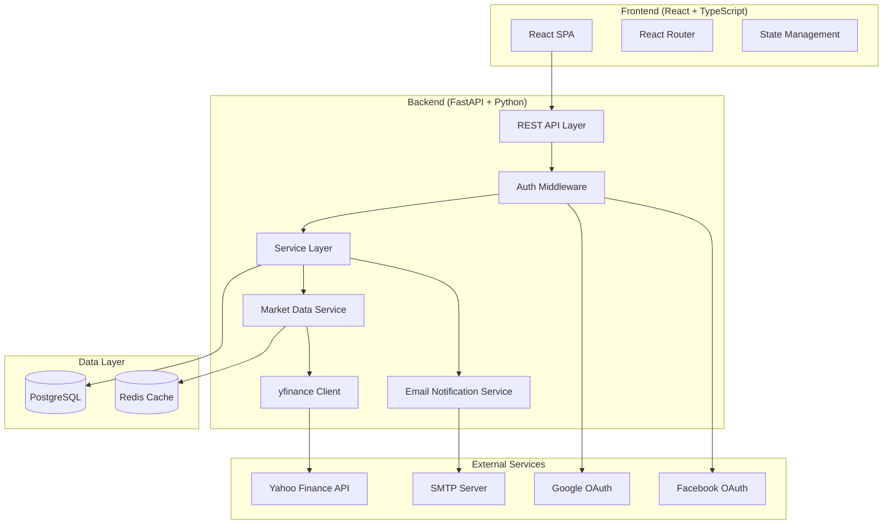
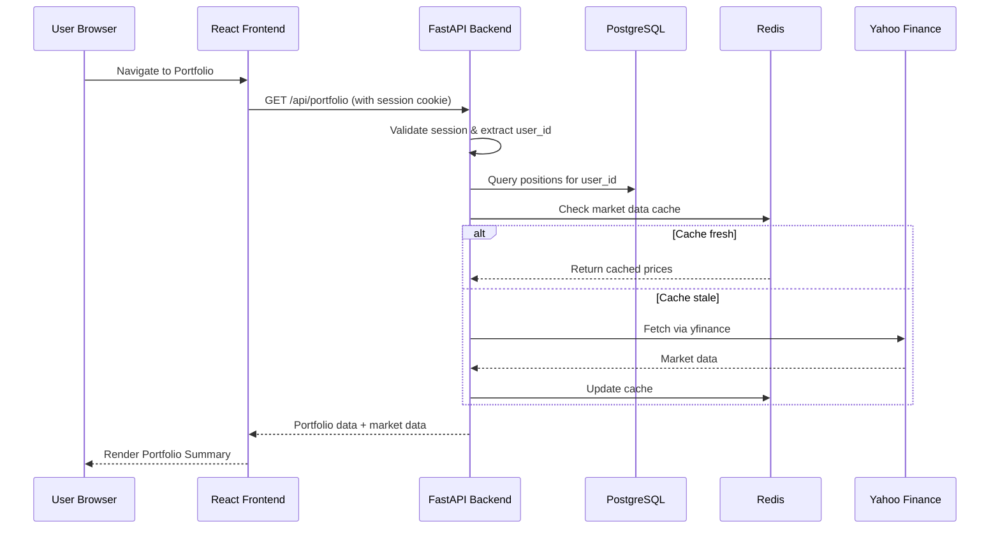

# Design Document: Investment History

## Overview

The Investment History system is a full-stack web application for stock investors to track trades, monitor portfolios, and analyze investment performance. The system provides a Python/FastAPI backend with yfinance integration for market data, a React frontend for rich interactive UI, and PostgreSQL for persistent multi-user data storage. All monetary values are displayed in USD ($) except on the Money Transfers page which uses THB (฿). The application is branded as "My Investment" with a royal blue (#0052FF) theme and full-width layout.

### Key Design Decisions

1. **FastAPI (Python) Backend**: Chosen because the requirements mandate yfinance (Python library) for market data. FastAPI provides async support, automatic OpenAPI docs, built-in validation via Pydantic, and straightforward OAuth integration.

2. **React + TypeScript Frontend**: Provides a component-based architecture suitable for the 9+ pages, interactive charts (sector heatmap, performance history), and real-time data displays required.

3. **PostgreSQL Database**: Multi-user data isolation, transactional integrity for financial records, and robust querying for filtered views and aggregations.

4. **Redis Cache**: Caches market data from Yahoo Finance to respect rate limits and meet the "configurable threshold" caching requirement (default 1 hour for portfolio, 15 minutes for trending).

5. **OAuth 2.0 via Authlib**: Handles Google and Facebook authentication flows without managing passwords directly.

## Architecture

### High-Level Architecture Diagram



### Request Flow



### Layered Architecture

- **Presentation Layer**: React SPA with React Router for navigation, component library for UI
- **API Layer**: FastAPI routes organized by domain (trading, transfers, portfolio, etc.)
- **Service Layer**: Business logic, validation, calculations (Avg Cost, P/L, allocations)
- **Data Access Layer**: SQLAlchemy ORM models and repository pattern
- **Infrastructure Layer**: Database, cache, external API integrations

## Components and Interfaces

### Backend Components

#### 1. Authentication Module (`/api/auth/`)

| Endpoint | Method | Description |
|----------|--------|-------------|
| `/api/auth/login/google` | GET | Initiate Google OAuth flow |
| `/api/auth/login/facebook` | GET | Initiate Facebook OAuth flow |
| `/api/auth/callback/google` | GET | Handle Google OAuth callback |
| `/api/auth/callback/facebook` | GET | Handle Facebook OAuth callback |
| `/api/auth/logout` | POST | Terminate session |
| `/api/auth/me` | GET | Get current user info |

#### 2. Trading Log Module (`/api/transactions/`)

| Endpoint | Method | Description |
|----------|--------|-------------|
| `/api/transactions` | GET | List transactions (with filters) |
| `/api/transactions` | POST | Create buy/sell transaction |
| `/api/transactions/{id}` | PUT | Edit transaction |
| `/api/transactions/{id}` | DELETE | Delete transaction |
| `/api/transactions/snapshot` | POST | Bulk import snapshot |

**Note:** The snapshot import endpoint accepts a wrapped payload: `{entries: [...]}` where each entry contains the snapshot fields. API list responses are wrapped in objects (e.g., `{items: [...]}`, `{ideas: [...]}`).

#### 3. Money Transfer Module (`/api/transfers/`)

| Endpoint | Method | Description |
|----------|--------|-------------|
| `/api/transfers` | GET | List transfers (with filters) |
| `/api/transfers` | POST | Create transfer record |
| `/api/transfers/{id}` | PUT | Edit transfer |
| `/api/transfers/{id}` | DELETE | Delete transfer |

#### 4. Portfolio Module (`/api/portfolio/`)

| Endpoint | Method | Description |
|----------|--------|-------------|
| `/api/portfolio/summary` | GET | Aggregated portfolio with market data |
| `/api/portfolio/refresh` | POST | Force market data refresh |
| `/api/portfolio/{symbol}/sentiment` | PUT | Set sentiment (Bear/Bull) |
| `/api/portfolio/rebalancing` | GET | Get rebalancing insights |
| `/api/portfolio/rebalancing/targets` | PUT | Set target allocations |
| `/api/portfolio/risk-metrics` | GET | Get risk metrics |
| `/api/portfolio/sector-heatmap` | GET | Get sector heatmap data |

#### 5. Performance Module (`/api/performance/`)

| Endpoint | Method | Description |
|----------|--------|-------------|
| `/api/performance/snapshots` | GET | List snapshots (with filters) |
| `/api/performance/snapshots` | POST | Record portfolio snapshot |
| `/api/performance/snapshots/{id}` | PUT | Edit snapshot |
| `/api/performance/snapshots/{id}` | DELETE | Delete snapshot |

#### 6. Dashboard Module (`/api/dashboard/`)

| Endpoint | Method | Description |
|----------|--------|-------------|
| `/api/dashboard` | GET | Aggregated dashboard data |

#### 7. Trade Journal Module (`/api/journal/`)

| Endpoint | Method | Description |
|----------|--------|-------------|
| `/api/transactions/{id}/notes` | PUT | Attach/update note |
| `/api/transactions/{id}/tags` | PUT | Set tags on transaction |
| `/api/journal/tags` | GET | List all tags with filtering |

#### 8. Price Alerts Module (`/api/alerts/`)

| Endpoint | Method | Description |
|----------|--------|-------------|
| `/api/alerts` | GET | List active alerts |
| `/api/alerts` | POST | Create alert |
| `/api/alerts/{id}` | DELETE | Delete alert |

#### 9. Dividend Tracker Module (`/api/dividends/`)

| Endpoint | Method | Description |
|----------|--------|-------------|
| `/api/dividends` | GET | List dividend records |
| `/api/dividends` | POST | Record dividend payment |
| `/api/dividends/summary` | GET | Dividend summary by stock/period |
| `/api/dividends/projection` | GET | Projected annual income |

#### 10. Realized P/L Module (`/api/realized-pl/`)

| Endpoint | Method | Description |
|----------|--------|-------------|
| `/api/realized-pl` | GET | List realized P/L records |
| `/api/realized-pl/summary` | GET | Cumulative totals (monthly/yearly/all-time) |

#### 11. Watchlist Module (`/api/watchlist/`)

| Endpoint | Method | Description |
|----------|--------|-------------|
| `/api/watchlist` | GET | List watchlist with market data |
| `/api/watchlist` | POST | Add stock to watchlist |
| `/api/watchlist/{id}` | PUT | Update notes/target price |
| `/api/watchlist/{id}` | DELETE | Remove from watchlist |

#### 12. Trending Stocks Module (`/api/trending/`)

| Endpoint | Method | Description |
|----------|--------|-------------|
| `/api/trending` | GET | Get trending/gainers/losers/active |

**Note:** The trending endpoint returns objects with a `symbol` field (not `stock_symbol`) for each trending item.

#### 13. Stock Tags Module (`/api/tags/`)

| Endpoint | Method | Description |
|----------|--------|-------------|
| `/api/tags` | GET | List all tags |
| `/api/tags` | POST | Create tag |
| `/api/tags/{id}` | DELETE | Delete tag |
| `/api/tags/{id}/stocks` | GET | Stocks with this tag |
| `/api/stocks/{symbol}/tags` | PUT | Assign tags to stock |
| `/api/tags/performance` | GET | Performance metrics per tag |

#### 14. Investment Ideas Module (`/api/ideas/`)

| Endpoint | Method | Description |
|----------|--------|-------------|
| `/api/ideas` | GET | List ideas (with filters) |
| `/api/ideas` | POST | Create idea |
| `/api/ideas/{id}` | PUT | Update idea |
| `/api/ideas/{id}` | DELETE | Delete idea |

#### 15. Stock Screener Module (`/api/screener/`)

| Endpoint | Method | Description |
|----------|--------|-------------|
| `/api/screener/search` | POST | Execute screener query |
| `/api/screener/presets` | GET | List saved presets |
| `/api/screener/presets` | POST | Save preset |
| `/api/screener/presets/{id}` | DELETE | Delete preset |

#### 16. Admin Module (`/api/admin/`)

| Endpoint | Method | Description |
|----------|--------|-------------|
| `/api/admin/users` | GET | List all users (admin only) |
| `/api/admin/users/{id}/approve` | POST | Approve user |
| `/api/admin/users/{id}/block` | POST | Block user |
| `/api/admin/users/{id}/status` | PUT | Change user status |

### Frontend Components

#### Page Components

| Page | Route | Description |
|------|-------|-------------|
| Login | `/login` | OAuth login buttons |
| Dashboard | `/` | High-level overview |
| Trading Log | `/trading` | Transaction CRUD + journal |
| Money Transfers | `/transfers` | Transfer CRUD |
| Portfolio Summary | `/portfolio` | Positions + market data |
| Performance History | `/performance` | Historical snapshots + charts |
| Trade Journal | `/journal` | Notes/tags view |
| Watchlist | `/watchlist` | Monitored stocks |
| Investment Ideas | `/ideas` | Thesis board |
| Admin | `/admin` | User management (admin only) |

#### Shared Components

- `NavigationMenu`: Persistent sidebar with white background, blue pill active state, emoji icons, section labels, and "My Investment" branding with custom logo
- `ConfirmationToast`: Success/error messages (visible 3+ seconds)
- `MarketDataBadge`: Display market data freshness timestamp
- `FilterPanel`: Reusable filter controls (date range, symbol, broker, etc.)
- `DataTable`: Sortable, filterable table component with clickable column headers
- `useSortableData`: Reusable hook implementing tri-state sort (Ascending ▲ → Descending ▼ → No sort) for strings, numbers, and percentages
- `SectorHeatmap`: Treemap visualization colored by ROI
- `PerformanceChart`: Line chart for portfolio value over time

### Service Layer Interfaces

```python
# Core service interfaces (Python)

class TradingService:
    async def create_transaction(self, user_id: str, data: TransactionCreate) -> Transaction
    async def edit_transaction(self, user_id: str, tx_id: str, data: TransactionUpdate) -> Transaction
    async def delete_transaction(self, user_id: str, tx_id: str) -> None
    async def list_transactions(self, user_id: str, filters: TransactionFilters) -> list[Transaction]
    async def import_snapshot(self, user_id: str, entries: list[SnapshotEntry]) -> list[Transaction]
    async def get_holdings(self, user_id: str, symbol: str) -> int  # total held quantity

class TransferService:
    async def create_transfer(self, user_id: str, data: TransferCreate) -> Transfer
    async def edit_transfer(self, user_id: str, transfer_id: str, data: TransferUpdate) -> Transfer
    async def delete_transfer(self, user_id: str, transfer_id: str) -> None
    async def list_transfers(self, user_id: str, filters: TransferFilters) -> list[Transfer]

class PortfolioService:
    async def get_summary(self, user_id: str) -> PortfolioSummary
    async def calculate_avg_cost(self, user_id: str, symbol: str) -> Decimal
    async def calculate_allocation(self, user_id: str) -> dict[str, Decimal]
    async def set_sentiment(self, user_id: str, symbol: str, sentiment: str) -> None
    async def get_rebalancing(self, user_id: str) -> RebalancingData
    async def set_target_allocation(self, user_id: str, targets: dict[str, Decimal]) -> None
    async def get_risk_metrics(self, user_id: str) -> RiskMetrics

class MarketDataService:
    async def get_ticker_info(self, symbol: str) -> TickerInfo
    async def refresh_all(self, symbols: list[str]) -> dict[str, TickerInfo]
    async def get_trending(self) -> TrendingData
    async def is_cache_stale(self, symbol: str, max_age_seconds: int) -> bool

class PerformanceService:
    async def record_snapshot(self, user_id: str, data: SnapshotCreate) -> PerformanceSnapshot
    async def list_snapshots(self, user_id: str, filters: SnapshotFilters) -> list[PerformanceSnapshot]
    async def calculate_period_return(self, current: Decimal, previous: Decimal) -> Decimal
    async def get_cumulative_return(self, user_id: str) -> Decimal

class DashboardService:
    async def get_overview(self, user_id: str) -> DashboardData

class AuthService:
    async def initiate_oauth(self, provider: str) -> str  # returns redirect URL
    async def handle_callback(self, provider: str, code: str) -> SessionToken
    async def validate_session(self, token: str) -> User
    async def logout(self, token: str) -> None

class AdminService:
    async def list_users(self) -> list[UserAccount]
    async def approve_user(self, admin_id: str, user_id: str) -> None
    async def block_user(self, admin_id: str, user_id: str) -> None

class EmailNotificationService:
    async def send_alert_email(self, user_email: str, alert: PriceAlert, current_price: Decimal) -> bool
    def is_enabled(self) -> bool  # checks ALERT_EMAIL_ENABLED env var
    def _build_html_template(self, alert: PriceAlert, current_price: Decimal) -> str
```

## Data Models

### Entity Relationship Diagram

```mermaid
erDiagram
    USER ||--o{ TRANSACTION : owns
    USER ||--o{ TRANSFER : owns
    USER ||--o{ PERFORMANCE_SNAPSHOT : owns
    USER ||--o{ PRICE_ALERT : owns
    USER ||--o{ DIVIDEND_RECORD : owns
    USER ||--o{ WATCHLIST_ITEM : owns
    USER ||--o{ INVESTMENT_IDEA : owns
    USER ||--o{ SCREENER_PRESET : owns
    USER ||--o{ STOCK_SENTIMENT : owns
    USER ||--o{ TARGET_ALLOCATION : owns
    TRANSACTION ||--o| TRANSACTION_NOTE : has
    TRANSACTION }o--o{ TAG : tagged_with
    STOCK_TAG_ASSIGNMENT }o--|| TAG : uses
    WATCHLIST_ITEM ||--o| TAG : tagged_with

    USER {
        uuid id PK
        string display_name
        string email
        string profile_picture_url
        string oauth_provider
        string oauth_provider_id
        enum status "Approved|Pending|Blocked"
        boolean is_admin
        datetime registered_at
        datetime last_login_at
    }

    TRANSACTION {
        uuid id PK
        uuid user_id FK
        date date
        string stock_symbol
        enum action "Buy|Sell|Snapshot"
        int quantity
        decimal price_per_share
        decimal gross_value
        decimal brokerage_fee
        decimal vat
        decimal net_capital_flow
        string broker
        datetime created_at
        datetime updated_at
    }

    TRANSACTION_NOTE {
        uuid id PK
        uuid transaction_id FK
        text note
        datetime created_at
        datetime updated_at
    }

    TAG {
        uuid id PK
        uuid user_id FK
        string name
        datetime created_at
    }

    TRANSACTION_TAG {
        uuid transaction_id FK
        uuid tag_id FK
    }

    STOCK_TAG_ASSIGNMENT {
        uuid id PK
        uuid user_id FK
        string stock_symbol
        uuid tag_id FK
    }

    TRANSFER {
        uuid id PK
        uuid user_id FK
        date date
        string broker
        enum transfer_type "In|Out"
        decimal amount
        datetime created_at
        datetime updated_at
    }

    PERFORMANCE_SNAPSHOT {
        uuid id PK
        uuid user_id FK
        date date
        decimal total_portfolio_value
        decimal total_cost
        datetime created_at
        datetime updated_at
    }

    PRICE_ALERT {
        uuid id PK
        uuid user_id FK
        string stock_symbol
        enum alert_type "Above|Below"
        decimal target_price
        string note
        boolean triggered
        datetime created_at
    }

    DIVIDEND_RECORD {
        uuid id PK
        uuid user_id FK
        date date
        string stock_symbol
        decimal amount_per_share
        int shares_held
        decimal total_amount
        datetime created_at
    }

    REALIZED_PL {
        uuid id PK
        uuid user_id FK
        date date
        string stock_symbol
        int sell_quantity
        decimal sell_price
        decimal avg_cost_at_sale
        decimal realized_pl
        int hold_duration_days
        enum term_type "Short-term|Long-term"
        uuid transaction_id FK
        datetime created_at
    }

    WATCHLIST_ITEM {
        uuid id PK
        uuid user_id FK
        string stock_symbol
        decimal interested_at_price
        text notes
        datetime created_at
        datetime updated_at
    }

    INVESTMENT_IDEA {
        uuid id PK
        uuid user_id FK
        string stock_symbol
        string title
        text thesis
        decimal target_entry_price
        enum risk_level "Low|Medium|High"
        string source_link
        enum status "Researching|Watching|Bought|Passed|Closed"
        uuid linked_transaction_id FK
        datetime created_at
        datetime updated_at
    }

    STOCK_SENTIMENT {
        uuid id PK
        uuid user_id FK
        string stock_symbol
        enum sentiment "Bear|Bull"
        datetime updated_at
    }

    TARGET_ALLOCATION {
        uuid id PK
        uuid user_id FK
        string target_key
        enum target_type "Symbol|Sector"
        decimal target_percentage
        datetime updated_at
    }

    SCREENER_PRESET {
        uuid id PK
        uuid user_id FK
        string name
        json filter_criteria
        datetime created_at
    }

    SESSION {
        uuid id PK
        uuid user_id FK
        string token_hash
        datetime expires_at
        datetime created_at
    }
```



### Key Pydantic Models (Request/Response)

```python
from decimal import Decimal
from datetime import date
from enum import Enum
from pydantic import BaseModel, Field, validator
import re

class ActionType(str, Enum):
    BUY = "Buy"
    SELL = "Sell"
    SNAPSHOT = "Snapshot"

class TransferType(str, Enum):
    IN = "In"
    OUT = "Out"

class TransactionCreate(BaseModel):
    date: date
    stock_symbol: str = Field(min_length=1, max_length=20, pattern=r'^[A-Z0-9.]+$')
    action: ActionType
    quantity: int = Field(gt=0, le=99_999_999)
    price_per_share: Decimal = Field(gt=0, le=Decimal('99999999.99'))
    brokerage_fee: Decimal = Field(ge=0)
    vat: Decimal = Field(ge=0)
    broker: str = Field(min_length=1, max_length=100)
    note: str | None = Field(None, max_length=1000)

    @validator('date')
    def date_not_future(cls, v):
        from datetime import date as today_date
        if v > today_date.today():
            raise ValueError('Date cannot be in the future')
        return v

    @validator('stock_symbol')
    def symbol_uppercase(cls, v):
        return v.upper()

class TransactionResponse(BaseModel):
    id: str
    date: date
    stock_symbol: str
    action: ActionType
    quantity: int
    price_per_share: Decimal
    gross_value: Decimal
    brokerage_fee: Decimal
    vat: Decimal
    net_capital_flow: Decimal
    broker: str
    note: str | None
    tags: list[str]
    created_at: str

class TransferCreate(BaseModel):
    date: date
    broker: str = Field(min_length=1, max_length=100)
    transfer_type: TransferType
    amount: Decimal = Field(ge=Decimal('0.01'), le=Decimal('999999999.99'))

    @validator('date')
    def date_not_future(cls, v):
        from datetime import date as today_date
        if v > today_date.today():
            raise ValueError('Date cannot be in the future')
        return v

    @validator('broker')
    def broker_not_blank(cls, v):
        if not v.strip():
            raise ValueError('Broker name cannot be blank')
        return v.strip()

    @validator('amount')
    def amount_max_decimals(cls, v):
        if v.as_tuple().exponent < -2:
            raise ValueError('Amount must have at most 2 decimal places')
        return v

class PortfolioPositionResponse(BaseModel):
    stock_symbol: str
    quantity: int
    avg_cost: Decimal
    total_cost: Decimal
    market_value: Decimal | None
    unrealized_pl: Decimal | None
    roi_percent: Decimal | None
    allocation_percent: Decimal
    sentiment: str | None
    # Market data fields (from Yahoo Finance)
    company_name: str | None
    sector: str | None
    industry: str | None
    current_price: Decimal | None
    previous_close: Decimal | None
    day_high: Decimal | None
    day_low: Decimal | None
    fifty_two_week_low: Decimal | None
    fifty_two_week_high: Decimal | None
    market_cap: int | None
    pe_trailing: Decimal | None
    pe_forward: Decimal | None
    average_volume: int | None
    beta: Decimal | None
    dividend_yield: Decimal | None
    price_to_book: Decimal | None
    last_refresh: str | None

class DashboardResponse(BaseModel):
    total_invested: Decimal
    total_withdrawn: Decimal
    net_invested: Decimal
    total_market_value: Decimal | None
    overall_pl: Decimal | None
    overall_roi_percent: Decimal | None
    total_positions: int
    total_brokers: int
    capital_per_broker: list[dict]
    market_data_complete: bool
```

### Calculation Logic

#### Gross Value
```
gross_value = quantity × price_per_share
```

#### Net Capital Flow
```
If action == "Buy":
    net_capital_flow = gross_value + brokerage_fee + vat
If action == "Sell":
    net_capital_flow = gross_value - brokerage_fee - vat
```

#### Average Cost (Weighted)
```
avg_cost = Σ(quantity_i × price_per_share_i) / Σ(quantity_i)
    where i ∈ {all Buy transactions + Snapshot entries for that symbol}
```

#### Unrealized P/L
```
unrealized_pl = (current_price × quantity) - (avg_cost × quantity)
```

#### ROI Percent
```
roi_percent = (unrealized_pl / total_cost) × 100
```

#### Allocation
```
allocation = (position_total_cost / Σ all_positions_total_cost) × 100
```

#### Realized P/L (per sell transaction)
```
realized_pl = (sell_price - avg_cost_at_time_of_sale) × sell_quantity
```

#### Period Return
```
period_return = ((current_value - previous_value) / previous_value) × 100
```

#### Portfolio Beta
```
portfolio_beta = Σ(position_allocation_i × beta_i) for all positions
```


## Correctness Properties

*A property is a characteristic or behavior that should hold true across all valid executions of a system—essentially, a formal statement about what the system should do. Properties serve as the bridge between human-readable specifications and machine-verifiable correctness guarantees.*

### Property 1: Net Capital Flow Calculation

*For any* valid transaction (buy or sell) with quantity Q, price P, brokerage fee F, and VAT V, the gross_value SHALL equal Q × P, and the net_capital_flow SHALL equal (Q × P) + F + V for buys or (Q × P) - F - V for sells.

**Validates: Requirements 1.1, 1.2, 1.3**

### Property 2: Invalid Transaction Inputs Are Rejected

*For any* transaction submission where at least one of the following holds: a required field is missing, quantity ≤ 0, price_per_share ≤ 0, brokerage_fee < 0, VAT < 0, date is not YYYY-MM-DD format, or date is in the future — the system SHALL reject the transaction and return a validation error identifying the invalid field(s).

**Validates: Requirements 1.4, 1.5, 1.7, 1.8**

### Property 3: Holdings Quantity Invariant

*For any* stock symbol and user, the total held quantity SHALL equal the sum of all buy quantities plus all snapshot quantities minus all sell quantities. No operation (sell, delete, edit) SHALL be permitted if it would cause any symbol's held quantity to become negative.

**Validates: Requirements 1.6, 2.2, 6.1, 6.3**

### Property 4: Snapshot Import Atomicity

*For any* batch of snapshot entries where at least one entry fails validation (missing field, quantity ≤ 0, or price ≤ 0), the system SHALL reject the entire batch and persist none of the entries.

**Validates: Requirements 2.5, 2.4, 2.6**

### Property 5: Transfer Validation

*For any* money transfer where the amount is outside [0.01, 999,999,999.99], has more than 2 decimal places, the broker name is empty/whitespace-only, transfer type is not "In"/"Out", or date is invalid/future — the system SHALL reject the transfer and return a validation error.

**Validates: Requirements 3.4, 3.5, 3.6, 3.7**

### Property 6: Query Results Are Sorted

*For any* user's trading log query, the returned transactions SHALL be sorted by date in descending order. *For any* user's transfer history query, the returned records SHALL be sorted by date in descending order. *For any* performance snapshot query, results SHALL be sorted by date in ascending order.

**Validates: Requirements 3.2, 4.1, 10.2**

### Property 7: Filter Correctness (AND Logic)

*For any* set of filter criteria applied to a query (date range, stock symbol, broker, action type), every item in the result set SHALL satisfy ALL active filter conditions, and no item satisfying all conditions SHALL be excluded from the result set. Broker and symbol matching SHALL be case-insensitive.

**Validates: Requirements 3.3, 4.2, 4.3, 4.4, 4.5, 4.6**

### Property 8: Average Cost Weighted Calculation

*For any* stock symbol held by a user, the average cost SHALL equal the sum of (quantity × price_per_share) across all buy and snapshot entries for that symbol, divided by the total quantity from those entries.

**Validates: Requirements 5.2**

### Property 9: Allocation Sum Invariant

*For any* portfolio with one or more positions, the sum of all position allocations SHALL equal 100% (within floating-point tolerance). Each individual allocation SHALL equal that position's total_cost divided by the sum of all positions' total_costs, multiplied by 100.

**Validates: Requirements 5.3**

### Property 10: Portfolio Aggregate Totals

*For any* portfolio, the Total Summary aggregate Total Cost SHALL equal the sum of individual positions' Total Cost values; aggregate Market Value SHALL equal the sum of individual positions' Market Value values; aggregate Unrealized P/L SHALL equal aggregate Market Value minus aggregate Total Cost.

**Validates: Requirements 5.4**

### Property 11: Zero-Quantity Exclusion

*For any* portfolio summary result, no position in the result set SHALL have a held quantity of zero.

**Validates: Requirements 5.5**

### Property 12: Dashboard Monetary Aggregations

*For any* set of money transfers, Total Invested SHALL equal the sum of all "In" amounts, Total Withdrawn SHALL equal the sum of all "Out" amounts, Net Invested SHALL equal Total Invested minus Total Withdrawn, and each broker's net capital SHALL equal its "In" total minus its "Out" total.

**Validates: Requirements 9.1, 9.4**

### Property 13: Period Return Calculation

*For any* two consecutive performance snapshots where the previous value is greater than zero, the period return SHALL equal ((current_value - previous_value) / previous_value) × 100, to 2 decimal places.

**Validates: Requirements 10.3**

### Property 14: Cumulative Return Calculation

*For any* sequence of performance snapshots with at least two entries, the cumulative return SHALL equal ((latest_value - earliest_value) / earliest_value) × 100, to 2 decimal places.

**Validates: Requirements 10.4**

### Property 15: Price Alert Trigger Correctness

*For any* price alert with alert_type and target_price, and a current market price, the alert SHALL be triggered if and only if: (alert_type == "Above" AND current_price >= target_price) OR (alert_type == "Below" AND current_price <= target_price).

**Validates: Requirements 14.2**

### Property 16: Realized P/L Calculation

*For any* sell transaction where the average cost at time of sale is known, the realized P/L SHALL equal (sell_price_per_share - avg_cost_at_sale) × sell_quantity. The record SHALL be classified as "Short-term" if hold_duration_days < 365, or "Long-term" if hold_duration_days ≥ 365.

**Validates: Requirements 16.1, 16.5**

### Property 17: Target Allocation Sum Constraint

*For any* set of target allocations configured by a user, the sum of all target percentages SHALL equal exactly 100%.

**Validates: Requirements 17.1**

### Property 18: Portfolio Beta Weighted Average

*For any* portfolio with positions that have known beta values, the portfolio beta SHALL equal the sum of (each position's allocation_weight × its beta_value) across all positions.

**Validates: Requirements 18.1**

### Property 19: Concentration Warning Thresholds

*For any* portfolio, the system SHALL display a sector concentration warning if and only if any single sector accounts for more than 50% of total portfolio value. The system SHALL display a position concentration warning if and only if any single stock accounts for more than 25% of total portfolio value.

**Validates: Requirements 18.3, 18.4**

### Property 20: Maximum Drawdown Calculation

*For any* sequence of portfolio value snapshots, the maximum drawdown SHALL equal the largest percentage decline from any peak to any subsequent trough in the sequence, calculated as (peak - trough) / peak × 100.

**Validates: Requirements 18.5**

### Property 21: Watchlist "At Target" Highlight

*For any* watchlist item with an "Interested At" price, the item SHALL be highlighted as "At Target" if and only if the current market price is less than or equal to the interested_at_price.

**Validates: Requirements 19.4**

### Property 22: Tag Filter Correctness

*For any* tag filter applied to portfolio or watchlist, every item in the result set SHALL have the specified tag assigned, and no item with that tag SHALL be excluded.

**Validates: Requirements 21.4**

### Property 23: Per-Tag Performance Aggregation

*For any* custom tag assigned to one or more stocks, the aggregated metrics for that tag SHALL equal: total_cost = Σ(individual stock total_costs), total_market_value = Σ(individual stock market_values), unrealized_pl = total_market_value - total_cost, roi_percent = unrealized_pl / total_cost × 100.

**Validates: Requirements 21.5**

### Property 24: Per-User Data Isolation

*For any* two distinct users A and B, querying any data resource (transactions, transfers, portfolio, watchlist, alerts, ideas, dividends, performance snapshots, tags, presets) as user A SHALL never return any record belonging to user B.

**Validates: Requirements 27.1, 27.2, 27.3, 27.4**

### Property 25: Edit Recalculation Consistency

*For any* successfully edited transaction, the stored gross_value SHALL equal the new quantity × new price_per_share, the net_capital_flow SHALL follow the formula for the transaction's action type, and the portfolio holdings (total quantity and avg_cost) for affected symbols SHALL be consistent with the full transaction history after the edit.

**Validates: Requirements 6.5**

### Property 26: Dividend Yield on Cost Calculation

*For any* stock with recorded dividend payments and a known total cost, the dividend yield on cost SHALL equal (total annual dividends for that stock / total cost of that stock) × 100.

**Validates: Requirements 15.3**

## Error Handling

### API Error Response Format

All API errors return a consistent JSON structure:

```json
{
  "error": {
    "code": "VALIDATION_ERROR",
    "message": "Human-readable error description",
    "details": [
      {
        "field": "quantity",
        "message": "Value must be greater than zero"
      }
    ]
  }
}
```

### Error Categories

| Category | HTTP Status | Code | Description |
|----------|-------------|------|-------------|
| Validation Error | 400 | `VALIDATION_ERROR` | Input fails validation rules |
| Missing Field | 400 | `MISSING_FIELD` | Required field not provided |
| Insufficient Holdings | 400 | `INSUFFICIENT_HOLDINGS` | Sell/delete would create negative quantity |
| Not Found | 404 | `NOT_FOUND` | Resource does not exist |
| Access Denied | 403 | `ACCESS_DENIED` | User lacks permission |
| Unauthorized | 401 | `UNAUTHORIZED` | No valid session |
| Pending Approval | 403 | `PENDING_APPROVAL` | Account awaiting admin approval |
| Blocked | 403 | `ACCOUNT_BLOCKED` | Account has been blocked |
| Market Data Error | 502 | `MARKET_DATA_ERROR` | Yahoo Finance fetch failed |
| Symbol Not Found | 404 | `SYMBOL_NOT_FOUND` | Ticker not found on Yahoo Finance |
| Save Failed | 500 | `SAVE_FAILED` | Database persistence failure |
| Rate Limited | 429 | `RATE_LIMITED` | Too many requests to external API |

### Error Handling Strategy

1. **Validation Errors**: Caught at the Pydantic model level before reaching business logic. Return all field-level errors at once (not one at a time).

2. **Business Rule Violations**: Caught in the service layer. The service checks holdings before allowing sells/deletes/edits.

3. **External Service Failures (Yahoo Finance)**:
   - Network timeout: Return cached data if available, display staleness warning
   - Rate limiting: Implement exponential backoff, return cached data
   - Symbol not found: Mark symbol as unavailable, display N/A for market fields
   - Partial failure: Succeed for symbols that worked, report failures for others

4. **Database Failures**:
   - Connection loss: Retry up to 3 times with backoff
   - Constraint violation: Return appropriate business error
   - Save failure: Keep data in-memory on frontend, allow retry

5. **Authentication Errors**:
   - OAuth callback failure: Show error on login page with retry option
   - Session expired: Redirect to login, preserve current URL for post-login redirect
   - Invalid session: Clear cookie, redirect to login

6. **Frontend Error Handling**:
   - Display toast notifications for success/error (Requirements 8.3, 8.4)
   - Toast visible for minimum 3 seconds or until dismissed
   - On save failure, retain form data in state (Requirements 8.5, 8.6)
   - Network errors show offline indicator

## Testing Strategy

### Testing Approach

This project uses a dual testing approach:

1. **Property-Based Tests (PBT)**: Verify universal computation and validation properties across generated inputs. Used for business logic, calculations, and data integrity invariants.

2. **Unit Tests**: Verify specific examples, integration points, edge cases, and error conditions. Used for OAuth flows, market data integration, and UI behavior.

3. **Integration Tests**: Verify component interactions, database queries, and external service integration with mocked dependencies.

### Property-Based Testing Configuration

- **Library**: [Hypothesis](https://hypothesis.readthedocs.io/) (Python) for backend property tests
- **Frontend**: [fast-check](https://fast-check.dev/) (TypeScript) for frontend calculation logic
- **Minimum iterations**: 100 per property test
- **Tag format**: `Feature: investment-history, Property {number}: {property_text}`

### Test Organization

```
tests/
├── property/                    # Property-based tests
│   ├── test_calculations.py     # Properties 1, 8, 9, 10, 12, 13, 14, 16, 18, 20, 23, 26
│   ├── test_validation.py       # Properties 2, 4, 5
│   ├── test_holdings.py         # Property 3
│   ├── test_queries.py          # Properties 6, 7, 22
│   ├── test_alerts.py           # Properties 15, 19, 21
│   ├── test_isolation.py        # Property 24
│   └── test_edits.py            # Properties 11, 17, 25
├── unit/                        # Example-based unit tests
│   ├── test_trading_service.py
│   ├── test_transfer_service.py
│   ├── test_portfolio_service.py
│   ├── test_market_data.py
│   ├── test_auth_service.py
│   └── test_admin_service.py
├── integration/                 # Integration tests
│   ├── test_api_trading.py
│   ├── test_api_auth.py
│   ├── test_api_portfolio.py
│   ├── test_yfinance_client.py
│   └── test_database.py
└── frontend/                    # Frontend tests
    ├── property/
    │   ├── calculations.test.ts  # Frontend calculation properties
    │   └── validation.test.ts    # Frontend validation properties
    └── unit/
        ├── components/
        └── pages/
```

### Property Test Implementation Plan

Each correctness property maps to one property-based test:

| Property | Test File | Strategy |
|----------|-----------|----------|
| 1: Net Capital Flow | `test_calculations.py` | Generate random qty, price, fee, vat; verify formulas |
| 2: Input Rejection | `test_validation.py` | Generate invalid transactions (missing fields, bad values) |
| 3: Holdings Invariant | `test_holdings.py` | Generate sequences of buy/sell/snapshot; verify total |
| 4: Snapshot Atomicity | `test_validation.py` | Generate batches with invalid entries; verify rollback |
| 5: Transfer Validation | `test_validation.py` | Generate invalid transfers; verify rejection |
| 6: Sort Order | `test_queries.py` | Generate records with random dates; verify ordering |
| 7: Filter AND Logic | `test_queries.py` | Generate records + random filter combos; verify intersection |
| 8: Avg Cost | `test_calculations.py` | Generate buy/snapshot sets; verify weighted average |
| 9: Allocation Sum | `test_calculations.py` | Generate multi-position portfolios; verify sum=100% |
| 10: Aggregate Totals | `test_calculations.py` | Generate positions; verify sums |
| 11: Zero Exclusion | `test_edits.py` | Generate positions with some at zero; verify exclusion |
| 12: Dashboard Aggregations | `test_calculations.py` | Generate transfers; verify monetary sums |
| 13: Period Return | `test_calculations.py` | Generate snapshot pairs; verify formula |
| 14: Cumulative Return | `test_calculations.py` | Generate snapshot sequences; verify formula |
| 15: Alert Trigger | `test_alerts.py` | Generate alert configs + prices; verify trigger logic |
| 16: Realized P/L | `test_calculations.py` | Generate sell params; verify formula + classification |
| 17: Target Sum | `test_edits.py` | Generate target allocations; verify sum=100% |
| 18: Portfolio Beta | `test_calculations.py` | Generate positions with betas; verify weighted avg |
| 19: Concentration Warnings | `test_alerts.py` | Generate portfolios; verify threshold triggers |
| 20: Max Drawdown | `test_calculations.py` | Generate value sequences; verify max drawdown |
| 21: Watchlist At Target | `test_alerts.py` | Generate items + prices; verify highlight logic |
| 22: Tag Filter | `test_queries.py` | Generate tagged items + filter; verify correctness |
| 23: Per-Tag Aggregation | `test_calculations.py` | Generate tagged stocks; verify aggregated metrics |
| 24: Data Isolation | `test_isolation.py` | Generate multi-user data; verify no cross-contamination |
| 25: Edit Recalculation | `test_edits.py` | Generate edits; verify recalculated values |
| 26: Dividend Yield | `test_calculations.py` | Generate dividend records; verify yield formula |

### Unit Test Coverage Areas

- OAuth flow: callback handling, session creation, token validation
- Admin actions: approve, block, status transitions, first-user-admin rule
- Market data service: caching logic, error handling, field mapping from yfinance
- Snapshot display: "(Snapshot)" label rendering
- Confirmation messages: 3-second display, dismissible
- Navigation: correct links, active state, admin-only visibility
- Investment ideas: status transitions, linking to transactions
- Stock screener: filter preset save/load, result limit (50)

### Integration Test Coverage Areas

- Full API request/response cycles with database
- Yahoo Finance integration with real or mocked responses
- OAuth provider callback handling
- Multi-user session management
- Concurrent access scenarios


## Deployment Architecture

### Docker Compose Services

The application is deployed as a 4-service Docker Compose stack:

```yaml
services:
  db:        # PostgreSQL database
  redis:     # Redis cache for market data
  backend:   # FastAPI application (Python 3.12-slim + uvicorn)
  frontend:  # React SPA (Node 20 build + nginx serve)
```

### Service Details

| Service | Base Image | Port | Description |
|---------|-----------|------|-------------|
| db | postgres:16 | 5432 | PostgreSQL database for all persistent data |
| redis | redis:7-alpine | 6379 | Market data cache and session store |
| backend | python:3.12-slim | 8000 | FastAPI app served via uvicorn |
| frontend | node:20 (build) + nginx:alpine (serve) | 80 | Multi-stage build: Node compiles React app, nginx serves static files |

### Environment Variables

```
# Database
DATABASE_URL=postgresql+asyncpg://user:pass@db:5432/investment

# Redis
REDIS_URL=redis://redis:6379/0

# OAuth
GOOGLE_CLIENT_ID=...
GOOGLE_CLIENT_SECRET=...
FACEBOOK_CLIENT_ID=...
FACEBOOK_CLIENT_SECRET=...

# Email Alerts (SMTP)
ALERT_EMAIL_ENABLED=true|false
SMTP_HOST=smtp.example.com
SMTP_PORT=587
SMTP_USER=alerts@example.com
SMTP_PASSWORD=...

# Application
SECRET_KEY=...
FRONTEND_URL=https://...
```

### Azure Deployment Options

1. **Azure Container Apps**: Deploy the Docker Compose stack with managed scaling and ingress
2. **Azure App Service**: Deploy backend and frontend as separate App Service instances with Azure Database for PostgreSQL and Azure Cache for Redis

### OAuth Provider Setup

- **Google OAuth**: Configure via Google Cloud Console → APIs & Services → Credentials
- **Facebook OAuth**: Configure via Meta for Developers → App Settings → Facebook Login

## UI/UX Design System

### Branding

- **App Name**: "My Investment"
- **Logo**: Custom logo displayed in sidebar header
- **Primary Color**: Royal blue (#0052FF)

### Color Palette

| Token | Value | Usage |
|-------|-------|-------|
| Primary | #0052FF | Buttons, active nav pills, accent links |
| Background | #F4F6F9 | Content area background |
| Surface | #FFFFFF | Cards, sidebar, modals |
| Shadow | soft box-shadow | Card elevation |

### Layout

- **Full-width**: Application utilizes the entire screen width
- **Sidebar**: Fixed-width white sidebar with navigation
- **Content**: Fluid content area with #F4F6F9 background

### Sidebar Design

- White background
- Blue pill-shaped active state indicator
- Emoji icons for each menu item
- Section labels grouping related pages (e.g., "Trading", "Analysis", "Tools")
- "My Investment" branding + logo at top

### Dashboard Cards

- Flat white background (#FFFFFF)
- 16px border-radius (rounded corners)
- Soft box-shadow for depth
- Centered text for key metric values

### Typography & Spacing

- Consistent spacing scale across all pages
- Clear hierarchy with appropriate font weights
- Readable font sizes for financial data

## Frontend Technical Notes

### `useSortableData` Hook

A reusable React hook for adding sort functionality to any table:

```typescript
interface SortConfig {
  key: string;
  direction: 'asc' | 'desc' | null;
}

function useSortableData<T>(items: T[], defaultSort?: SortConfig) {
  // Returns: { sortedItems, sortConfig, requestSort }
  // Clicking a header cycles: asc → desc → null (no sort)
  // Supports string, number, and percentage column types
}
```

### `toNum()` Helper

The frontend uses a `toNum()` utility function for safe string-to-number conversion from API responses. API responses may return numeric values as strings, and this helper ensures safe parsing without NaN propagation.

```typescript
function toNum(value: string | number | null | undefined): number {
  // Returns 0 for null/undefined/NaN, otherwise parses the value as a number
}
```

### API Response Wrapping

All list-type API responses are wrapped in objects rather than returning bare arrays:

```typescript
// Examples:
// GET /api/transactions → { items: [...] }
// GET /api/ideas → { ideas: [...] }
// GET /api/trending → { gainers: [...], losers: [...], active: [...] }
```

### Currency Display

- All pages display monetary values in USD ($) format
- Exception: Money Transfers page displays amounts in THB (฿)
- Frontend formatting functions handle the currency symbol based on context

